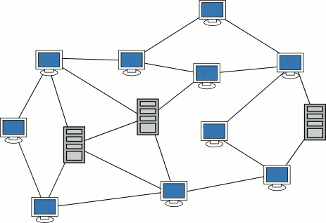
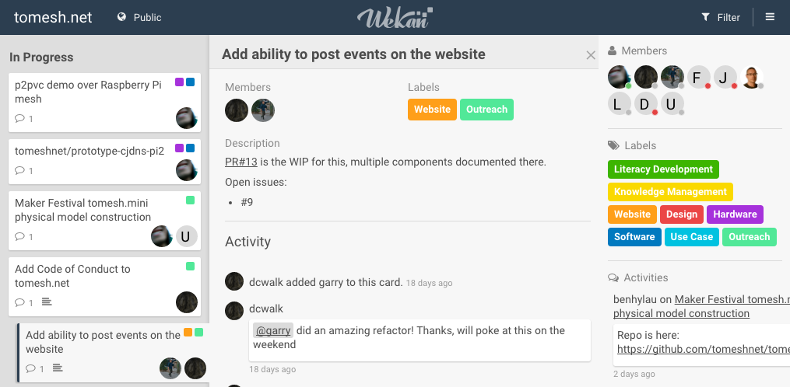
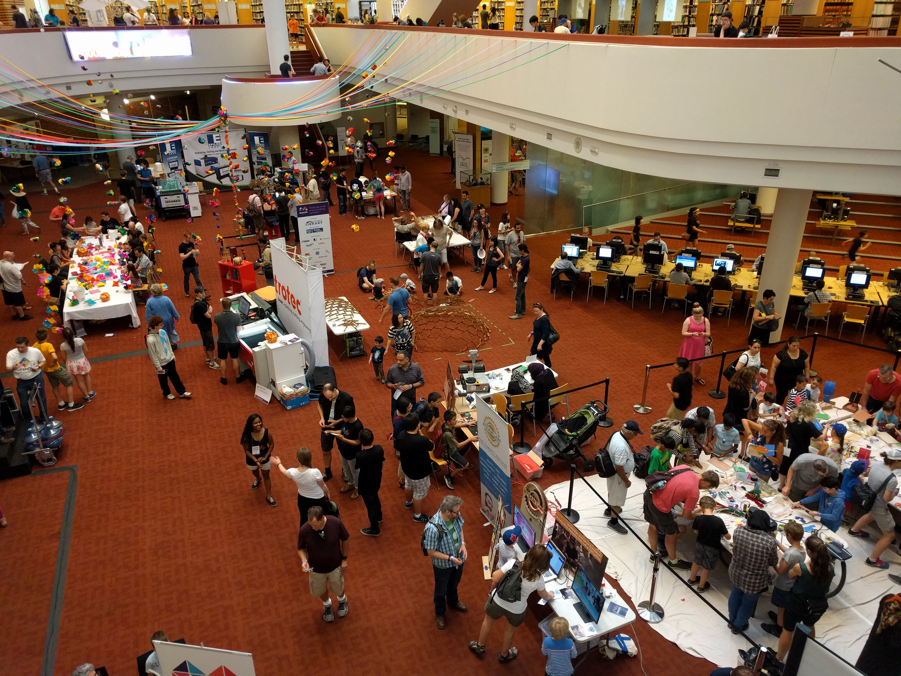
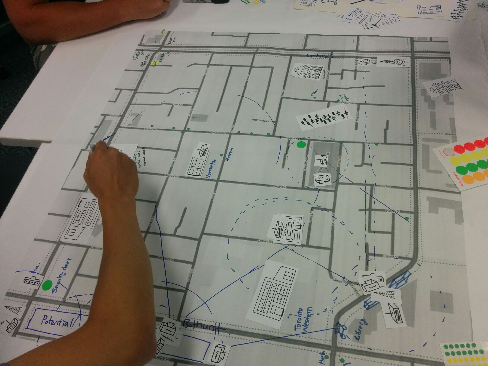
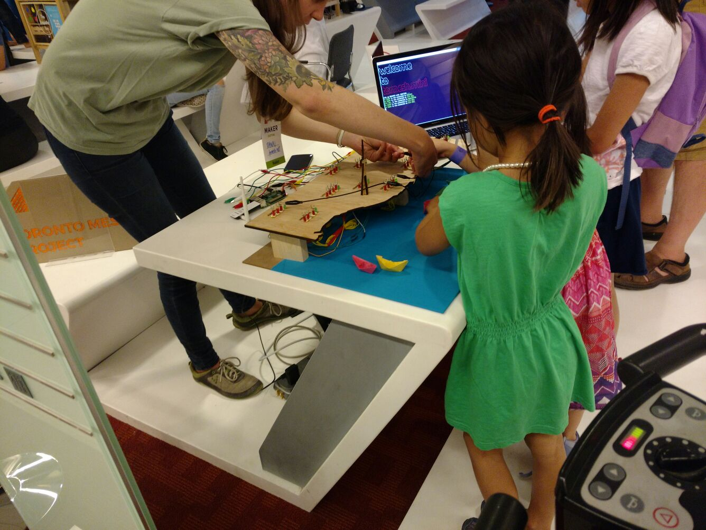
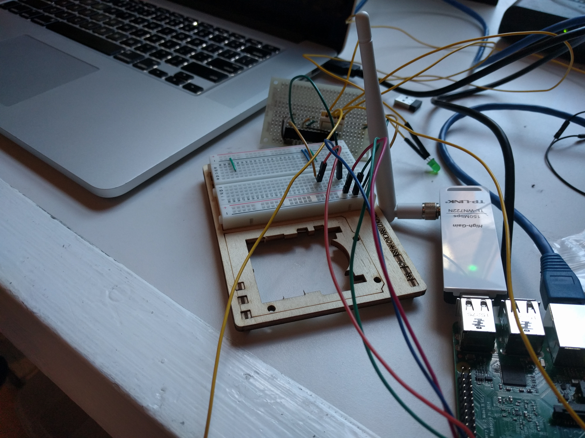
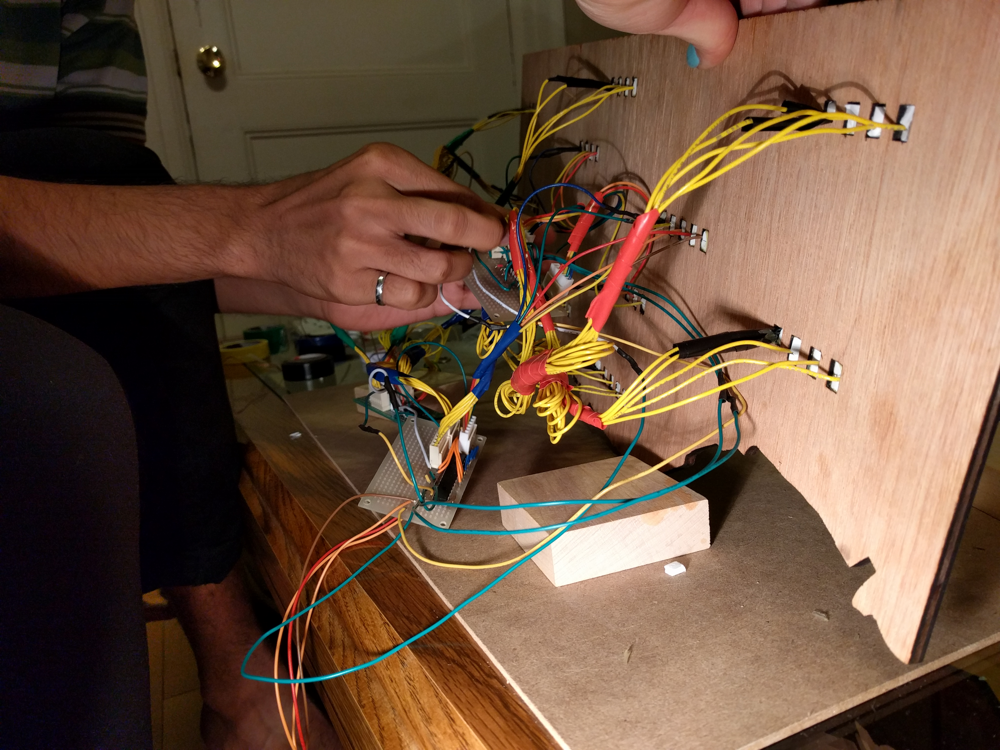
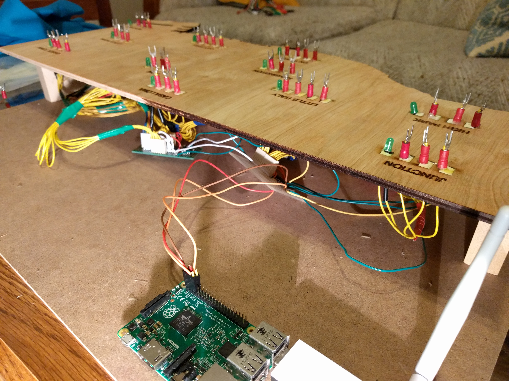
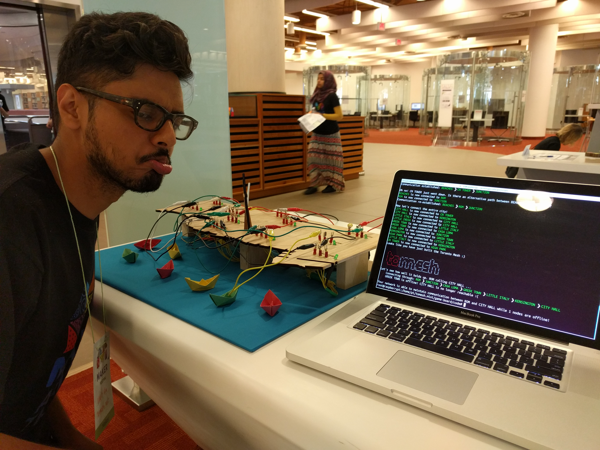

<!SLIDE title-slide>
# tomesh.net Update #

Ethan Wilding & Udit Vira

12 July 2016

<!SLIDE>
# Agenda #

**What's this mesh thing?**

**What we've been up to?**

<!SLIDE bullets>
# We believe... #

* Affordable internet access should be a civic (human) right
* Quality of access and public content/services should be decided by the community of users

~~~SECTION:notes~~~

We hold that affordable internet access should be a civic (human) right, and the quality of access and public content/services should be decided by the community of users and not dictated by a centralized internet service provider, corporate interest, or limited by purposefully restrictive device functionality.

~~~ENDSECTION~~~

<!SLIDE bullets>
# Issues #

* **Affordability**

	* Control of the *last-mile* allows for inflated fees
	* "One subscription per household/apartment" model
	* Rural, remote and poor communities aren't profitable

* **Privacy**
	
	* Is *free* internet at Starbucks really free?
	* Sign-up and Terms of Service agreement
	* Monitoring of usage activity

~~~SECTION:notes~~~

1. Affordability: Many people cannot afford home or wireless internet subscription fees in Canada; $50 to $100 / month is too much.  Why is it expensive? Because current providers control the "last-mile": the connection between the end-user access to the network, usually in a "one subscription for one household or one apartment" model; users have no control and few options. 

1b: Rural, remote, and poor communities do not have equal access to the internet because it's too expensive for current ISPs to provide. 

2. Privacy: For "free" internet, at a coffee shop like Starbucks, you either have to provide (pay with) personal information through a sign-up, purchase a coffee (gets expensive), or click "accept to the terms" of an unsecured connection wherein that company can monitor your online activity; it's also a public place, so you're monitored by everyone else around you.

~~~ENDSECTION~~~

<!SLIDE bullets>
# tomesh.net Solution #

* Reclaim the last-mile delivery
* Replace 1-to-1 subscription with secure wireless connectivity for the community
* Affordable infrastructure cost with wireless vs. underground cables, distributed among community of users
* Resiliency from decentralized topology
* Privacy & net-neutrality from encrypted protocol
* Easily deployable in rural and remote areas

~~~SECTION:notes~~~

A. Toronto Mesh addresses those issues by reclaiming the "last mile". Instead of an expensive 1 to 1 subscription model, tomesh uses a network of "routers" (nodes) to create a cloud of secure wireless connectivity for the entire community, not just individual households. We skip the expensive individual landlines (copper, cable, or fibre connections) and provide a redundant, secure, and encrypted mesh network of nodes that connects everyone in the region; in this model you can get internet access in your house, while you're walking down the street, and at your local watering hole. 

B. Affordable: Infrastructure cost is reduced because it operates wirelessly, and not through underground cables. The reduced cost is shared by the community of users, making it relatively affordable for everyone. 

C. Resilient: it uses a decentralized network of nodes, and still works even if a few nodes lose power; not dependent on single connections. 

D. Private: the network is encrypted at the protocol level, and no one has to provide extra personal information to use the network. This also helps ensure net-neutrality, where no internet packet is privileged above any other. 

E. Rural: Toronto Mesh can be deployed in rural and remote areas with much less cost than what a current ISP can provide. This moves us closer to ensuring that everyone can realize their right to affordable internet access. 

~~~ENDSECTION~~~

<!SLIDE bullets>

* Greatest challenge of bootstrapping a mesh network is building a community

* We're also trying to learn from others working in this space in other places

* **Upcoming**: HOPE conference and meeting with NYC Mesh

<!SLIDE>

We've been trying to engage an audience that may not know about us

* At the Maker Festival we tried to reach out to families and makers
* Satellite event at the Maker Festival
* Maker table at the Maker Festival Extravaganza

<!SLIDE>
# Maker Festival Satellite Event #

On June 25...

* Interactive workshop
* Sent messages over yarn and paper-planned a network covering Kensington
* Interesting discussions about different network topologies

<!SLIDE>
# tomesh.mini @ Maker Festival Extravaganza #

On July 9-10...

* Built a game to demonstrate mesh networks
* Great feedback from kids to adults
* Lots of interesting conversations

<!SLIDE>
# Making of...#

<!SLIDE>
# Making of...#

<!SLIDE>
# Making of...#

<!SLIDE bullets>

* We brought tomesh.mini over today! Come chat with us after the talk and we can play :)

