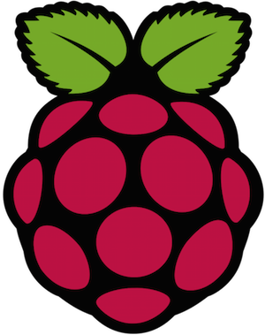
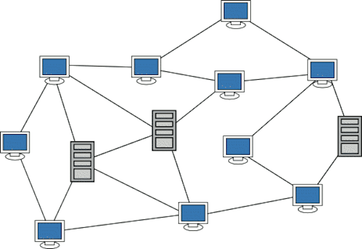
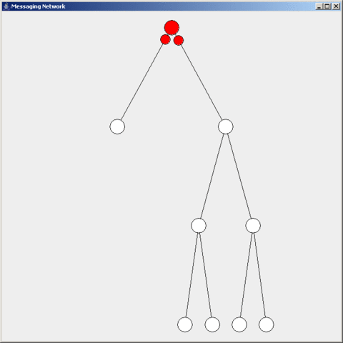

<!SLIDE title-slide>
# Build A Mesh Node #

Benedict Lau

21 August 2016

~~~SECTION:notes~~~

https://en.wikipedia.org/wiki/Cjdns#/media/File:Cjdns_logo.png
https://en.wikipedia.org/wiki/File:Raspberry_Pi_Logo.svg

~~~ENDSECTION~~~

<!SLIDE>
# What & Why #

**What** is a mesh network and **why** are we building it?

 

* Network topology where each node routes data for other nodes
* Does not rely on expensive central routers that take on the job of routing for everybody
* Form highly resilient "autonomous" networks

<!SLIDE>
# Delivering Packets #

Let's forward every packet to everyone!

**Flooding** is indeed how some mesh protocols get packets delivered, which works for small networks. Although it's easy to see how this approach wouldn't scale, it does illustrate how each node has the responsibility of **forwarding** packets for its neighbours.

~~~SECTION:notes~~~

https://en.wikipedia.org/wiki/Flooding_(computer_networking)#/media/File:FloodAck.gif

~~~ENDSECTION~~~

<!SLIDE>
# Why #

We seem dissatisfied with the Internet:

* Complain about **ISP service**
* Complain about **agencies spying on us**
* Complain about **companies profiting from our personal information**
* Complain about **countries censoring the Internet**
* Complain about **browsers having shitty security implementations and the certificate model is all broken**

By sharing the work of routing, we create a **distributed infrastructure** where participation is more **democratic**, which in turn gives users **agency** over these issues we keep complaining about.

~~~SECTION:notes~~~

http://walyou.com/internet-explorer-voodoo-doll/

~~~ENDSECTION~~~

<!SLIDE>
# Why *Now* #

**Because we can!**

Mesh networking is no longer accessible only to well-funded military and commercial applications, nor does the knowledge reside within proprietary and academic circles.

* Lowering cost of radio devices and "open-hardware"

* Developments in meshnet technology and communities (e.g. [Battle Mesh](http://battlemesh.org/))

* Validation through established meshnets (e.g. [Freifunk](https://freifunk.net/en/), [Guifi.net](https://guifi.net/en))

* Distributed applications that are highly compatible with mesh topology

There are lots of **free and open-source** mesh software supported by communities running **production networks** with **affordable hardware**, and tons of **distributed applications** running on them.

<!SLIDE>
# 802.11s Mesh Point #

* IEEE extension for mesh networking

* Relies on one of 802.11a/b/g/n/ac, not replace it

* Supported in some radios, such as the TP-LINK TL-WN722N (what we have here)

* Mesh over Layer 2 (Ethernet frames), so we still need some sort of Layer 3 infrastructure (IP addresses)

* We can use this to form small static or ad-hoc mesh networks

* We currently use it to form point-to-point links with forwarding disabled (rely on cjdns to do encrypted mesh routing instead)

See: https://en.wikipedia.org/wiki/IEEE_802.11s

See: https://wiki.openwrt.org/doc/howto/mesh.80211s

<!SLIDE>
# cjdns: Routing #

**Routing Table**

* Each node is responsible for tracking nearby nodes in address space (not the same as physical space)

* Distributed hash table (i.e. partial view of the network)

**Source Routing**

* Not flooding

* 8-byte **Route Label** consisting of **Directors**

* Requires no calculation at switch node (unlike traditional core routers)

* Vast majority of packets can be routed without a single memory lookup

* Switching route label can easily be implemented in hardware

See: https://www.youtube.com/watch?v=NRhMY-gdXDw

See: https://www.youtube.com/watch?v=4pC8EPPFmlE

See: https://github.com/cjdelisle/cjdns/blob/master/doc/Whitepaper.md

<!SLIDE>
# cjdns: Immediate Peers #

	$ nodejs /opt/cjdns/tools/peerStats

	v17.0000.0000.0000.0017.fwtwcm4uh1606zlpkj29sb8rm3ms74fjjfumhy7d0xhbmptndmt0.k ESTABLISHED in 9kb/s out 4kb/s  LOS 7 "outer"
	v17.0000.0000.0000.0015.6fpkf4xux4chbnu1kyu9j8xntz0h8c3l1s0k1njnxq3sxx2rgm80.k ESTABLISHED in 14kb/s out 6kb/s  LOS 6 "outer"
	v17.0000.0000.0000.0013.2scyvybg4qqms1c5c9nyt50b1cdscxnr6ycpwsxf6pccbmwuynk0.k ESTABLISHED in 12kb/s out 26kb/s  LOS 15 "groundupworks.com"

<!SLIDE>
# cjdns: Routing Table #

	$ nodejs /opt/cjdns/tools/dumptable

	ver       path                               addr                            bucket metric lastPinged
	v17.0000.0000.0000.0001.fn8zzfm784thq3phpf200r1d7k7ry7qdfpub9qc4nw75csnzhbz0.k 127 0 3568306
	v17.0000.0000.0000.0013.2scyvybg4qqms1c5c9nyt50b1cdscxnr6ycpwsxf6pccbmwuynk0.k 0 1024 13603
	v17.0000.0000.0000.0015.6fpkf4xux4chbnu1kyu9j8xntz0h8c3l1s0k1njnxq3sxx2rgm80.k 0 1024 13031
	v17.0000.0000.0000.0017.fwtwcm4uh1606zlpkj29sb8rm3ms74fjjfumhy7d0xhbmptndmt0.k 5 1024 14589
	v17.0000.0000.0000.0133.x667rxfwus4qnrhr12xxvhkpnuh3gd0r7uuyycl2z91zgcmdumy0.k 1 2048 48675
	v17.0000.0000.0000.0153.7ucw7mr8j3qns8zuxl0hptcxw71zlpzj691w3ykvr7wb15dgygx0.k 1 2048 337258
	v17.0000.0000.0000.01b3.1941p5k8qqvj17vjrkb9z97wscvtgc1vp8pv1huk5120cu42ytt0.k 4 2048 336503
	v17.0000.0000.0000.01d3.6vz7l9fd4k2b9dct7p5lysrcq5qb0w3xwk6gfs1xm7c3nfpwu5w0.k 1 2048 448154
	v17.0000.0000.0000.1353.rvu88bgvf0u2uzf8q5cydqk8z1s5lyscwqb6f4yq1fvv5wlg7t70.k 3 3072 12261
	v17.0000.0000.0000.8233.9jkygq92fxg3bpm7bp466gfvzg2vff5gb68uxpkg386yq8rdd5b0.k 3 3072 463512
	v18.0000.0000.0000.82b3.cmnkylz1dx8mx3bdxku80yw20gqmg0s9nsrusdv0psnxnfhqfmu0.k 2 3072 416233
	...
	v17.000d.27b8.c383.06b3.w4hq82mchvpd19p08zfghu7djhr3u1zuy39rqvputwxw3sbhvv10.k 2 1055744 20485
	v16.001b.3daf.9102.b357.t88uq346x2sydg598k2rtzqjhphq24fxrhfh89wk7j25m870nvs0.k 5 1049600 317359
	v16.0061.2e49.216a.b357.kcf3m6d2yjdr9jl9z89yt8nwrhq1zs051d452xnfnmkv3m9zuzq0.k 6 1049600 22122
	v17.0362.e269.4688.2633.4wnxxh40hv3njsnsq2d5kl2ccfqx1l6rfykqkhc34nnnh41zkqx0.k 2 3055746 438536
	v16.0533.ed49.216a.b357.m5dgp67mz1c7bjlcfdckx9vuph3dcdy9qj5mhmkf4mutuy2wb5k0.k 6 1050624 18883
	v17.098c.8628.ff13.e2b3.nbdngu4xn5x5wh111dndv6nx1x4f7hbz1q05pld4tf6rgfdvksh0.k 0 2100224 15838
	131 nodes 3 peers

<!SLIDE>
# cjdns: Configurations #

Doesn't cjdns advertise as a near-zero configuration mesh protocol?

**Generate a config file:**

	$ ./cjdroute --genconf > cjdroute.conf

This creates your unique cryptographic keys and node identity:

    privateKey: cb9c35a8beda7151341eed31ac4ece78288729ee51c37d71c475e514286c7bb0
    publicKey:  8q02ty48xf8qr9w70nbuw44n8bdthzf3hyl393bzku7nkb5bn250.k
    ipv6:       fc0b:6794:7937:9c15:5f38:a4cf:a7a9:5109

**Run with the config file:**

	$ sudo ./cjdroute < cjdroute.conf

All this is taken care of for you by the [tomesh install script](https://github.com/tomeshnet/prototype-cjdns-pi2/blob/master/scripts/install)! You run the installation once, it will generate the identity automatically, and each time you power up the Raspberry Pi it will start **cjdroute** with the generated **cjdroute.conf**.

<!SLIDE>
# cjdns: Public Key vs. IPv6 As Identity #

Derive an IPv6 so we have compatability with applications that support IPv6

Brute-force generate keys until double-SHA of public key lands in [fc00::/8](https://fc00.org)

There is a tool to derive it:

	$ cd /opt/cjdns && ./publictoip6 fwtwcm4uh1606zlpkj29sb8rm3ms74fjjfumhy7d0xhbmptndmt0.k
	fc3c:2533:e45c:9a5d:c7df:fd81:d5fd:1f5b

**Collision?**

>**1 in 1,329,227,995,784,915,872,903,807,060,280,344,576** chance of generating the same IPv6. Feeling Lucky?

Source: https://docs.meshwith.me/notes/arc-workings.html

<!SLIDE>
# cjdns: **cjdroute.conf** #

What else is in this config file?

* **admin**: The Admin API you can send messages to, which controls the running cjdroute process

* **interfaces**: The supported peering interfaces

	* **ETHInterface**: Peering over Ethernet broadcast domain (automatic over Layer 2)

	* **UDPInterface**: Peering over IP (manual over Layer 3/4, automatic over multicast has been discussed)

* **authorizedPasswords**: Credentials for manual peering over the UDPInterface

* **router**: Controls the cjdns router layer

	* **ipTunnel**: Use switch layer as VPN carrier to exit mesh traffic to the Internet (A model for an ISP: https://github.com/tomeshnet/mesh-isp)

<!SLIDE>
# Setting Up Your Node #

Grab a Raspberry Pi 3 and follow these steps:

https://github.com/tomeshnet/prototype-cjdns-pi2/blob/master/README.md#set-up

After **Step 2**, you should enter `sudo raspi-config` to:

1. Expand Filesystem

2. Change User Password

**IMPORTANT**: If you don't change your password and plug your Raspberry Pi to your home router, anyone can just grab your cjdns IPv6 (which is public), SSH in with the default Raspbian password and gain access to your home network. Ideally, you should set up public key authentication.

<!SLIDE>
# cjdns: Adding a UDPInterface Peer #

1. Edit the config file: `sudo nano /etc/cjdroute.conf`

2. Find the **UDPInterface** section:

		"UDPInterface":
	    [
	        {
	            // Nodes to connect to (IPv4 only).
	            "connectTo":
	            {
	                // Ask somebody who is already connected.
	            }
	        },
	        ...
	    ]

3. Paste [credentials of a public peer](http://transitiontech.ca/public) into the **connectTo** section:

		"104.200.29.163:53053":{
			"password":"0YUg6eJ06NHUCMZexLj2F2cGjeENgX3",
			"publicKey":"1941p5k8qqvj17vjrkb9z97wscvtgc1vp8pv1huk5120cu42ytt0.k",
			"contact":"ansuz@transitiontech.ca",
			"location":"Newark,NJ,USA"
		}

4. Restart cjdroute: `sudo killall cjdroute`

More details: https://github.com/cjdelisle/cjdns/blob/master/doc/cjdns/peering-over-UDP-IP.md

<!SLIDE>
# cjdns: Admin API #

API for controlling your **cjdroute** process, accessed through sending [BEncoded](https://en.wikipedia.org/wiki/Bencode) messages into a socket.

You can configure this Admin API socket in **/etc/cjdroute.conf**:

	"admin":
	{
	    // Port to bind the admin RPC server to.
	    "bind": "127.0.0.1:11234",

	    // Password for admin RPC server.
	    // This is a static password by default, so that tools like
	    // ./tools/cexec can use the API without you creating a
	    // config file at ~/.cjdnsadmin first. If you decide to
	    // expose the admin API to the network, change the password!
	    "password": "NONE"
	}

On the Raspberry Pi, try calling the `ping` function through the Admin API socket:

	$ echo -n 'd1:q4:pinge' | nc -u 127.0.0.1 11234
	d01:q4:ponge
	[Press CTRL + C to exit]

<!SLIDE>
# cjdns: Admin API in Python #

Some of the calls need authentication. In **cjdroute.conf**, replace `NONE` with `AN_ACTUAL_PASSWORD`.

To edit the config file, enter `sudo nano /etc/cjdroute.conf`, change the password and save.

Then you need to create **.cjdnsadmin** so the Python script can find the Admin API access credentials:

	$ echo '{"addr": "127.0.0.1", "port": 11234, "password": "AN_ACTUAL_PASSWORD"}' > ~/.cjdnsadmin

We're all set! Let's try to list all the Admin APIs:

	$ cd /opt/cjdns
	$ ./contrib/python/cexec 'functions()' | sort

Now try calling the same `ping` function, but this time through the Python API rather than manually constructing a BEncoded message (i.e. `d1:q4:pinge`):

	$ ./contrib/python/cexec 'ping()'

More on Admin API here: https://github.com/hyperboria/cjdns/blob/master/doc/admin-api.md

<!SLIDE>
# Measuring Network Throughput with iperf3 #

Start listening on one Raspberry Pi: `iperf3 -s`

Send packets from another Raspberry Pi: `iperf3 -c IPV6_OF_FIRST_PI`

See: https://github.com/tomeshnet/prototype-cjdns-pi2#network-benchmark

<!SLIDE>
# Can I run cjdns on *X*? #

**Most values of X**: https://github.com/cjdelisle/cjdns/

**Windows**: http://www.santacruzmesh.net/installer.html (Ask Jon)

**OpenWrt**: http://mesh.philly2600.net

**Raspbian**: https://github.com/tomeshnet/prototype-cjdns-pi2

**Android**: https://github.com/hyperboria/android/ (Work-in-progress, `irc.fc00.io/#android` for updates)
