title: Toronto Mesh
subtitle: and Our Platform Cooperatives
class: animation-fade
layout: true

---

class: center, middle, animation-fade

# Toronto Mesh

### Towards a Better Web

---

class: center, middle, animation-fade

  

    
Hello
my name is
  

  
[name goes here]

  

???
Hello! My name is [your name goes here].

---

class: center, middle

# Toronto Mesh

???
Toronto Mesh is a group of volunteers that was started at CivicTechTO in early 2016.

Our work includes, among other things, building hardware and software solutions for networking applications,

and organizing outreach activities that focus on technical literacy.

---

# Agenda

### Goal: Share ideas for building a better Web

???
Today, I will talk about some ways in which we can build a better Web together.

--

## 1. The Web Today: Issues 👎

## 2. The Web Tomorrow: Fixes 👍

## 3. Toronto Mesh

## 4. Toronto Mesh and You

???
First, I will talk about some of the challenges the Internet is facing today.

Then, I will discuss some of the solutions being explored to address them,

and how our work relates to them.

Finally, I will go over some of the ways in which you can contribute.

--

- We will only scratch the surface

???
I will only cover topics from a very high level,

so I apologize if I gloss over some things.

We can discuss plenty afterwards.

---

class: center, middle

# The Web Today

## A two-minute overview

???
What does the Web look like today?

---

class: center, middle

The Web Today

# Infrastructure

???
Let's start with infrastructure.

When I say "infrastructure" I mean everything that lives on the physical layer:

---

class: center, middle

## Infrastructure

<!-- ### The Physical Layer -->

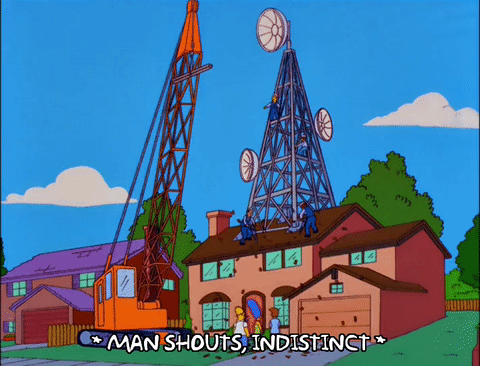

???
Cables, fibre, radios, antennas.

---

class: center, middle

Today's Infrastructure

# Internet Service Providers (ISPs)

# Governments

???
Most of the infrastructure that we use to go online is managed by Internet Service Providers (ISPs),

and in many cases, regulated by a government authority.

--

## Filtering - Censorship - Surveillance

???
Both of them may engage in filtering, censorship, and surveillance.

---

class: center

Today's Infrastructure: Filtering

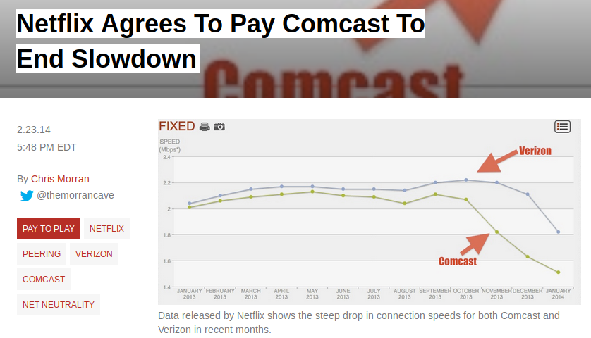

https://consumerist.com/2014/02/23/netflix-agrees-to-pay-comcast-to-end-slowdown/

???
Filtering may mean targeting certain kinds of traffic and slowing it down.

---

class: center

Today's Infrastructure: Censorship

https://www.visualcapitalist.com/internet-censorship-map/

???
Censorship is another kind of filtering.

Censorship at the infrastructure level is mostly dictated and carried out by government agencies.

This is a flowchart the Chinese government uses to assess online content.

Certain governments have opted for shutting down internet access altogether in times of civil unrest.

---

class: center

Today's Infrastructure: Surveillance

https://arstechnica.com/tech-policy/2017/03/senate-votes-to-let-isps-sell-your-web-browsing-history-to-advertisers/

???
Surveillance covers all types of data collection, whether it's for profit or for social control.

---

class: center, middle

The Web Today

# Services

???
Let's move on to services.

When I say "services, " I mean everything that lives on the digital layer:

---

class: center, middle

## Services

???
or things we can call software: apps, websites, desktop programs, ones and zeros.

---

class: center, middle

The Web Today: Services

<i class="fab fa-facebook"></i>
<i class="fab fa-twitter"></i>
<i class="fab fa-instagram"></i>
<i class="fab fa-tumblr"></i>
<i class="fab fa-linkedin-in"></i>
<i class="fab fa-reddit"></i>
<i class="fab fa-facebook-messenger"></i>
<i class="fab fa-whatsapp"></i>
<i class="fab fa-slack"></i>
<i class="fab fa-dropbox"></i>
<i class="fab fa-google-drive"></i>
<i class="fab fa-youtube"></i>

???
Think of the websites you visit and the apps you use on your  phone.

--

## Centralization - Censorship - Surveillance

???
Many of these services are controlled by centralized systems

that may also engage in censorship and surveillance practices.

---

class: center

Today's Services: Centralization

<i class="fab fa-google huge-icon"></i><i class="fab fa-facebook huge-icon"></i><i class="fab fa-amazon huge-icon"></i>

https://staltz.com/the-web-began-dying-in-2014-heres-how.html  
https://bdtechtalks.com/2017/10/27/why-does-the-centralized-internet-suck/  
https://techcrunch.com/2017/07/28/aws-wont-be-ceding-its-massive-market-share-lead-anytime-soon/ 

???
Regarding centralization-

Google, Facebook, and Amazon have come to dominate the services that support the internet.

Market dominance has turned these companies into gatekeepers of information,

so we have to trust them to use their power fairly and responsibly.

<!-- Google processes more than 5 billion queries per day.

Facebook has more than 2 billion monthly active users.

Amazon controls over one third of all cloud infrastructure services. -->

---

class: center

Today's Services: Centralization

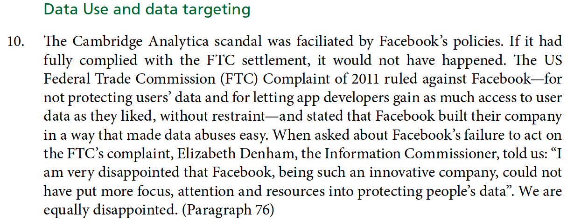

https://publications.parliament.uk/pa/cm201719/cmselect/cmcumeds/1791/1791.pdf

???
They do not.

In fact, all of them have huge financial incentives to not only monitor our behaviour,

but also manipulate it whenever possible.

---

class: center

Today's Services: Censorship

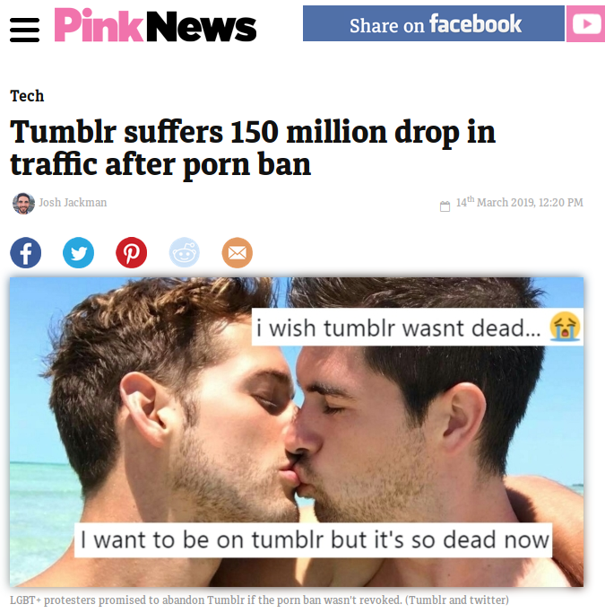
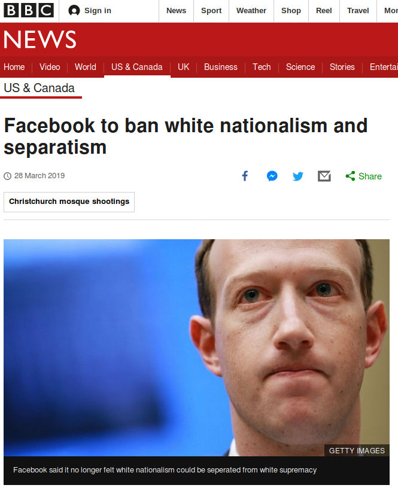

https://www.bbc.com/news/world-us-canada-47728471  
https://www.pinknews.co.uk/2019/03/14/tumblr-suffers-150-million-drop-traffic-porn-ban/

???
I'm not going to say hate speech should be given a platform, but

we _are_ relying on businesses to dictate social norms and police our communications.

---

class: center, middle

Today's Services: Surveillance

https://en.wikipedia.org/wiki/PRISM_%28surveillance_program%29  
https://www.telegraph.co.uk/technology/social-media/9780565/Facebook-terms-and-conditions-why-you-dont-own-your-online-life.html

???
The same businesses that not only claim ownership of our personal data, but 

also share it with governments agencies, marketing firms, researchers, and analysts.

---

class: middle, center

# The Web Tomorrow

???
So, we have identified some issues. What can we do about them?

---

class: middle, center

The Web Tomorrow

<h1>Infrastructure</h1>

<h1>Services</h1>

<h1><strong>Community</strong></h1>

???
Before we can begin doing any work on hardware or software,

we must recognize that technology has no purpose without the people using it.

The key part to building a better web is our Community!

It's the users who must demand and bring about change.

So, how do we prepare our community for tomorrow's web?

---

class: center, middle

The Web Tomorrow: Community

## 1. Awareness

This is us, here and now!

???
First off, we need people to become aware of the issues we have seen.

This may be as simple as finding out about how online services or governments routinely misuse our data.

--

## 2. Education

???
Developing literacy is the next step-

Maybe you want to become familiar with government policy,

build some networking know-how,

or research the business model of your favourite social network.

--

## 3. Engagement

???
Finally, a community can begin working on changes-

they may opt for adopting less intrusive services,

pushing for adequate legislation, or even building a network!

---

class: middle, center

### The Web Tomorrow

<h2>Community ️️️✔</h2>

<h1>Infrastructure</h1>

<h1>Services</h1>

???
In order to better understand some of the technologies around infrastructure and services,

there are three terms I need to explain.

---

class: center

The Web Tomorrow: Prerequisites

# <i class="fab fa-osi"></i> Open Source

### A product or service includes permission to use its source code, design documents, or data

#### Examples: 

### Linux OS

### Toronto Mesh

https://www.kernel.org/  
https://github.com/tomeshnet/documents/tree/master/governance

???
The first one is the concept of open source.

Open source means the data for a given product or service is available for study, analysis, or even modification.

This can apply to just about any area- software, hardware, or even governance.

One example is the Toronto Mesh governance documents that we make public through Github. 

---

class: center

The Web Tomorrow: Prerequisites

# <i class="fas fa-users"></i> Peer-to-Peer (P2P)

### Members work and communicate with one another without a central authority

#### Examples:

### BitTorrent

### RideAustin

https://www.rideaustin.com/  
https://en.wikipedia.org/wiki/BitTorrent

???
The next term is **peer-to-peer**.

In a peer-to-peer system, members of a group or network can communicate with one another,

instead of relying on a centralized service.

One example is RideAustin, a ride-sharing service that links riders directly to vehicle operators.

---

class: center

The Web Tomorrow: Prerequisites

#  Mesh Network

### Nodes connect to as many other nodes as possible, and cooperate with one another to efficiently transmit data back and forth.

#### Examples:

## Guifi.net
## Freifunk

https://en.wikipedia.org/wiki/Mesh_networking

???
Last is the concept of a Mesh Network.

Members of a mesh network, also called nodes, connect to as many other nodes as possible,

and cooperate with one another to efficiently transmit data back and forth.

Let's take a look at a couple of internet access models to see how this idea can work in practice.

---

class: center

Tomorrow's Web: Mesh Networks

### Access model: ISP <> Content

???
This is an over-simplified version of how we access the internet today. 

We connect to an ISP, and in turn they allow us to pull content from a service provider.

What would it look like with a mesh network?

---

class: center

Tomorrow's Web: Mesh Networks

### Access model: Mesh <> ISP <> Content

???
This is just one option. Using a mesh network, only a few computers need to have internet access,

and all of its members can still access content.

With these ideas in mind, let's talk about infrastructure in tomorrow's web.

---

class: center, middle

The Web Tomorrow: Infrastructure

## Ownership Models

???
Communities are exploring different ownership models for infrastructure.

--

### Community Networks 

### Public Sector

???
Some are leveraging mesh technologies to build networks based on their needs, 

while others are pushing local governments to provide affordable internet access.

---

class: center

Tomorrow's Infrastructure: Ownership Models

### Community Networks

https://www.nycmesh.net/map  
https://freifunk.net/en/how-to-join/find-your-nearest-community/

???
Two examples of community networks are Freifunk and NYCMesh.

Freifunk is a non-commercial grassroots initiative to support free computer networks in Germany.

NYCMesh is a non-profit project of the New York chapter of the Internet Society (ISOC-NY).

Having control of a network at the community level lowers the incentive for discriminating against network traffic,

and it makes censorship and surveillance harder to implement.

---

class: middle, center

The Web Tomorrow:

<h2>Community ️️️✔</h2>

<h2>Infrastructure ✔</h2>

<h1><del>Services</del> Protocols</h1>

### **Protocol**: A system of rules that allows entities in a communications system to transmit information

???
Now, what about services? We will stop talking about services now, and instead

focus on open source peer-to-peer protocols.

A protocol is just a set of rules that computers in a network use to communicate with one another.

---

class: center, middle

Tomorrow's Protocols

# Peer-to-peer Protocols

???
There are many peer-to-peer protocols out there,

but today I will talk about two. 

---

class: center

Tomorrow's Protocols: Social Networks

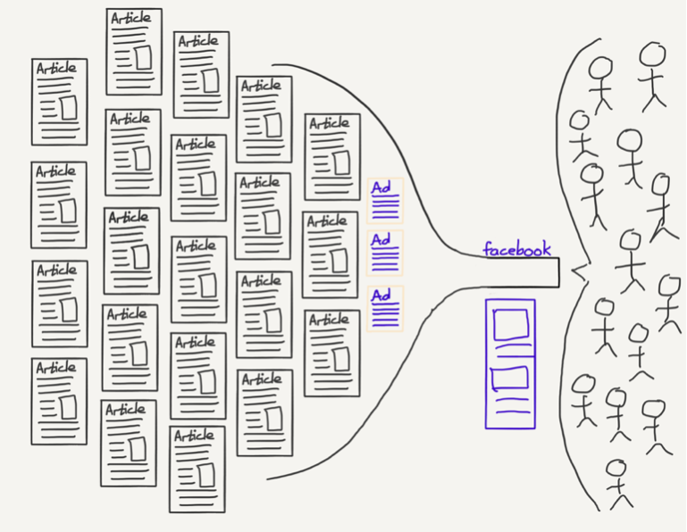

https://stratechery.com/2018/the-european-union-versus-the-internet/

???
Think about how we publish and access content on social networks.

Let's say a friend of mine posts a photo on facebook.

Facebook will add that post to my feed, and I'll see it next time I log in.

Can we think of another way to share our data?

---

class: center

Tomorrow's Protocols: Social Networks

### Access model: Mesh <> ISP <> Content

???
Let's go back to our earlier model for content access
---

class: center

Tomorrow's Protocols: Social Networks

### Access model: Mesh + P2P Content

???
Using peer-to-peer protocols, we are able to do away with centralized services

and share content directly with one another.

One such protocol is called Scuttlebutt.

---

class: center, middle

Tomorrow's Protocols: Social Networks

# Scuttlebutt

### A secure gossip platform

https://www.scuttlebutt.nz/

???
Scuttlebutt is a protocol for secure communications, on top of which different kinds of

applications can be built.

---

class: center

Tomorrow's Protocols: Social Networks

# Scuttlebutt

### Offline-friendly

???
Applications that work well offline and that no one person can control

--

### No central server

???
Scuttlebutt clients connect to their peers to exchange information- 

this means I hold my friends' data and they hold mine.

Because there are no central servers, 

--

### No central database

???
It is much harder to collect data on a massive scale

There is no "company" for a tech giant to buy, and no single database for governments to data mine.

---

class: center

Tomorrow's Protocols: Social Networks

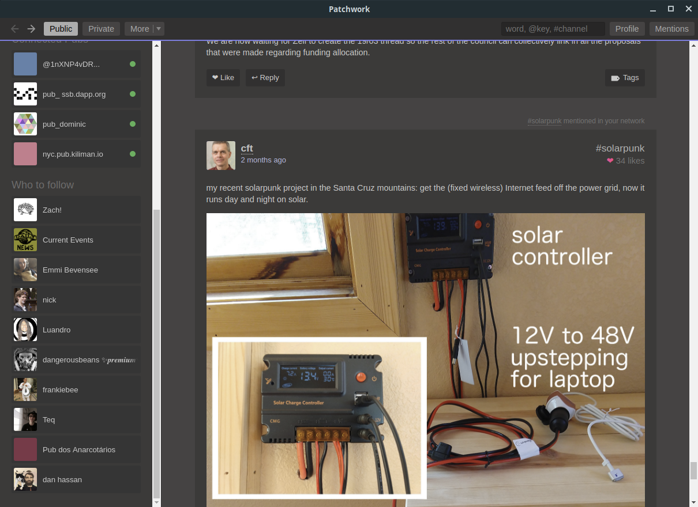

https://github.com/ssbc/patchwork

???
There are many clients for the scuttlebutt protocol, 

and this is one of them, it's called "Patchwork".

---

class: center

Tomorrow's Protocols: Content Sharing

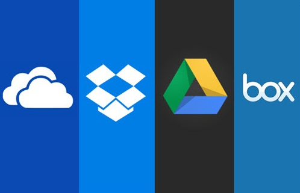
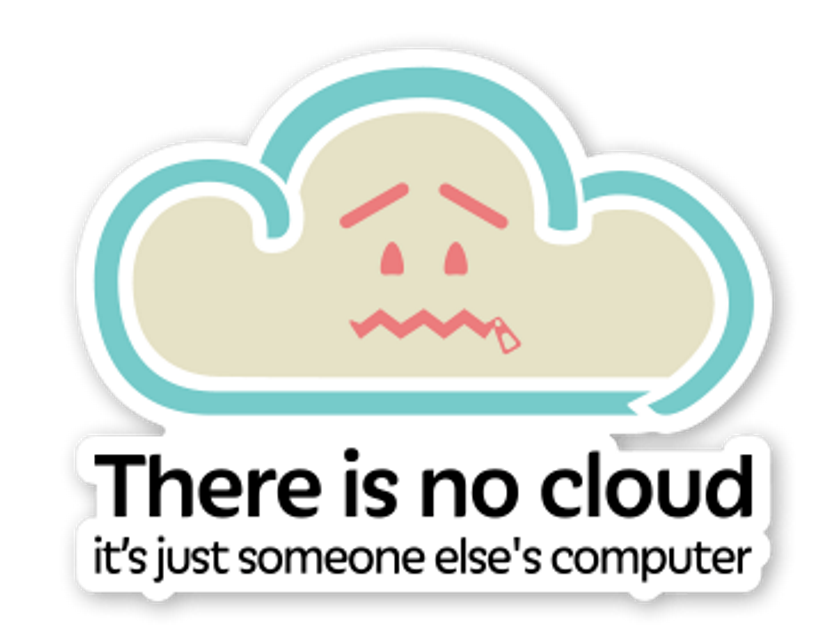

http://www.chriswatterston.com/blog/my-there-is-no-cloud-sticker

???
Can we apply the same concept to other online services?

How about file sharing?

---

class: center, middle

Tomorrow's Protocols: Content Sharing

# IPFS

## A peer-to-peer hypermedia protocol

https://ipfs.io

???
The Interplanetary File System (or IPFS for short) is a protocol we use

to host and share files. 

If I share a file with a friend through IPFS, a second friend can download it from both of us at the same time.

---

class: center

Tomorrow's Protocols: Content Sharing

https://ournetworks.ca/recorded-talks/

???
IPFS is being used to share talks recorded during last year's Our Networks conference.

---

class: center

Tomorrow's Protocols: Content Sharing

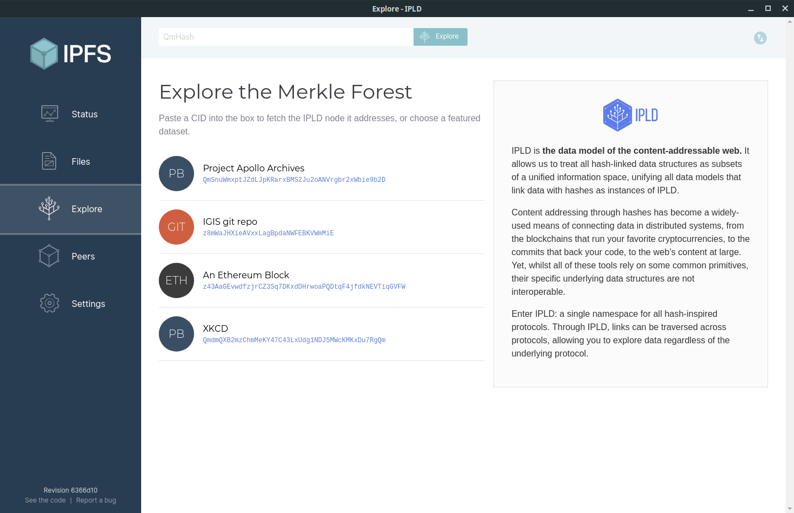

https://github.com/ipfs-shipyard/ipfs-desktop

???
Just like with Scuttlebutt, there are several clients built on top of the IPFS protocol.

Here is a screenshot of an IPFS Desktop app. It allows you to share and download files-

---

class: center

Tomorrow's Services: Content Sharing

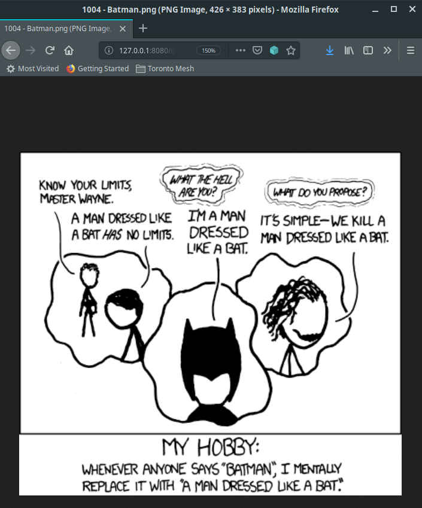

???
I was playing with that app when I was putting this presentation together, and

I found an image dataset from the Apollo missions and a collection of XKCD comics through it.

---

class: middle, center

# Toronto Mesh
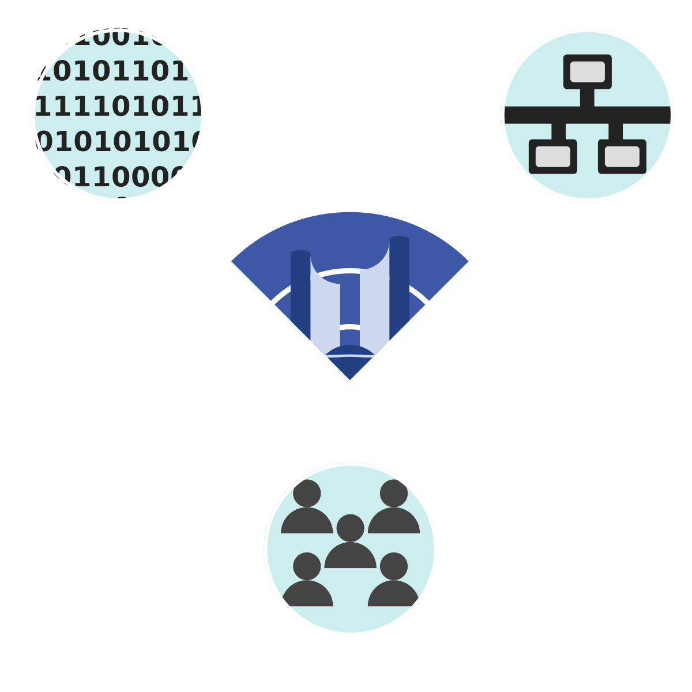

Bringing it all together

???
OK so we've covered the ingredients for a better Web.

So, where does Toronto Mesh fit in?

---

class: center

Toronto Mesh: Infrastructure

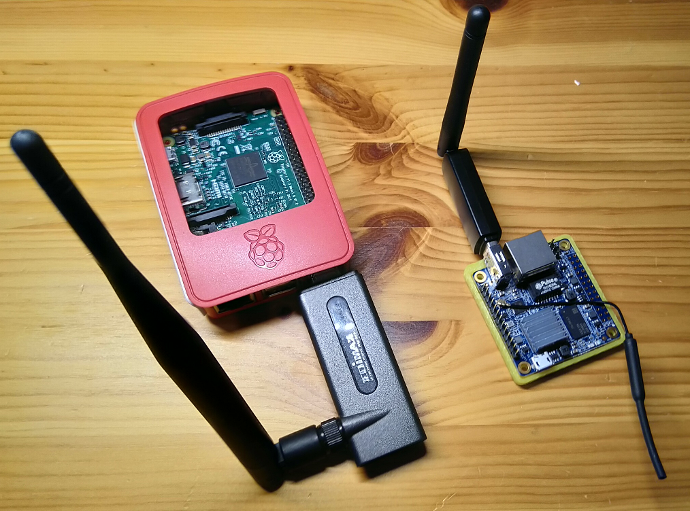

https://github.com/tomeshnet/prototype-cjdns-pi

???
For infrastructure, 

we have developed a reference platform that people can use to build or join a mesh network.

On the hardware side, a Toronto Mesh node consists of a single board computer 

and a mesh-enabled wifi dongle, like those shown in the picture.

---

class: center

Toronto Mesh: Protocols

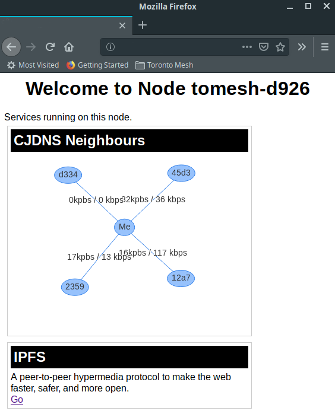

https://github.com/tomeshnet/prototype-cjdns-pi

???
For protocols, the platform has a number of modules to choose from-

you can pick one or two networking protocols to route and encrypt traffic,

whether to install Scuttlebutt and IPFS,

and a variety of monitoring tools.

The screenshot on the right shows the landing page for one of the nodes I have running at home.

---

Toronto Mesh: Community

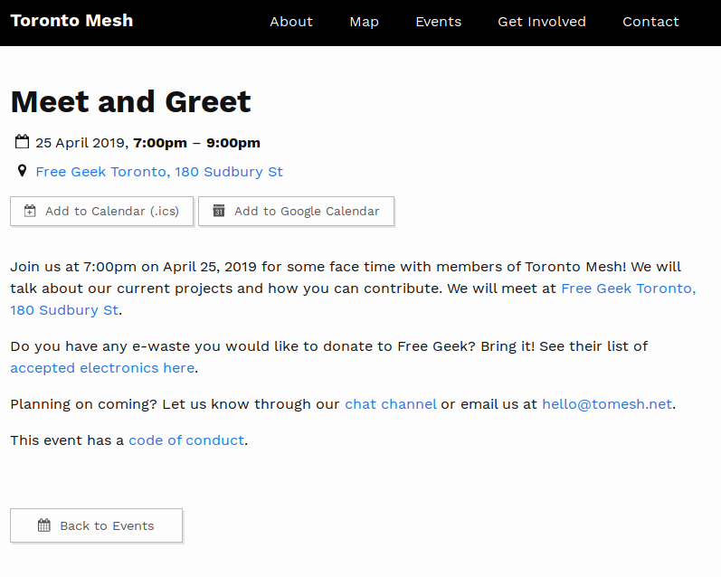
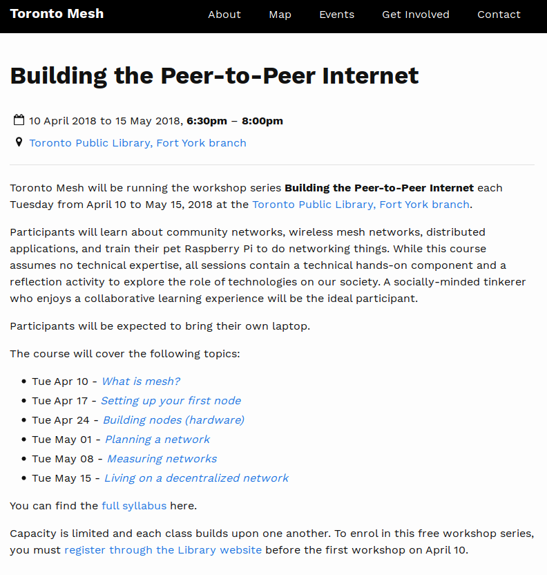

https://tomesh.net/events/  
https://github.com/tomeshnet/p2p-internet-workshop

???
On the community side, 

We hold monthly meetups where we bring together people looking to join a network,

and help them better understand the technology of our node platform.

Last year, we conducted a six-week course at Fort York Library, 

where group members taught participants about networking infrastructure,

peer-to-peer applications, and how to organize community networks.

We have worked very hard to make the workshop materials accessible for any person or group

looking to use it in their community.

---

class: center

Toronto Mesh: Community

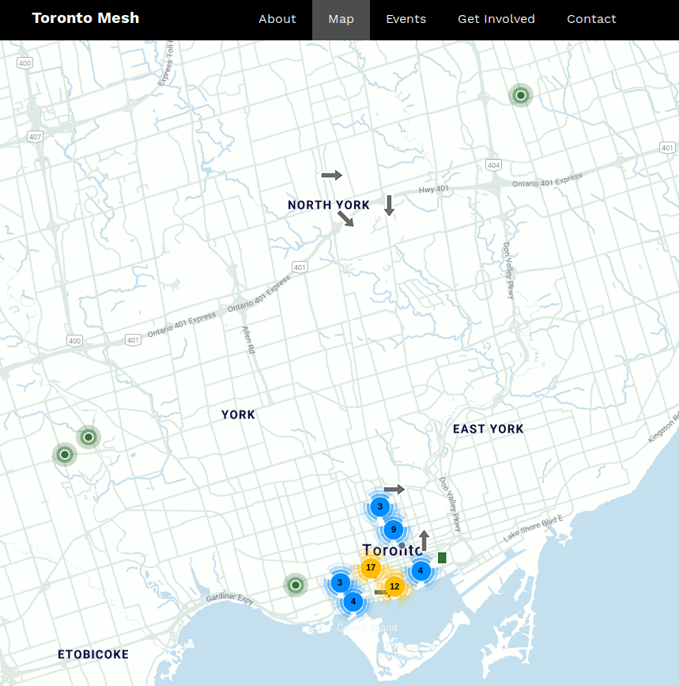
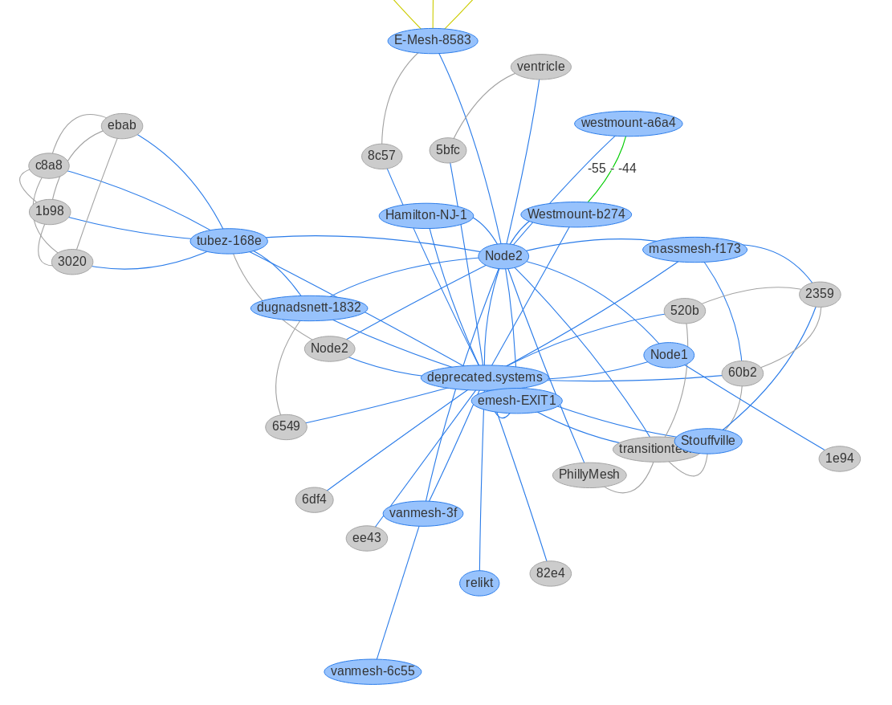

https://tomesh.net/map/  
http://meshwithme.online

???
Still on the community space:

The map on the left shows both our active nodes,

and the location of people willing to host nodes at home or work.

At this stage, we don't have a permanent wireless link between any two nodes,

so our mesh is linked through the internet. 

The site on the right shows all the nodes connected to the Toronto Mesh at any given time.

Which brings us to our last section-

---

class: middle, center

# Toronto Mesh and You

???
Toronto Mesh and You!

If you are interested in joining our group, there are tons of things to do.

---

class: center, middle

Toronto Mesh

## Join us!

### Community Engagement

???
Maybe you can help us grow awareness around peer-to-peer networks

and the alternatives to centralized systems that exist today.

--

### Deployment

???
Maybe you want to host a mesh node at your home or office to help us

test and grow the network. If we're lucky, you will be within range of an existing node.

--

### Tech Development

???
If you're into the technical stuff, we have lots of ideas to implement

on both hardware and software.

--

### Design

???
We also have a healthy backlog of design-related tasks, from branding and website design

to stickers and educational materials.

I have brought a couple of nodes with me today- if anyone wants to play with them,

discuss peer-to-peer systems or ask about contributing to Toronto Mesh, I will be around.

---

class: center, middle

### _The web is for everyone and collectively we hold the power to change it. It won’t be easy. But if we dream a little and work a lot, we can get the web we want._

## Sir Tim Berners-Lee

???
I will leave you with the words of Sir Tim Berners Lee on the 30th aniversary of the Web last month.

The web is for anyone and collectively we hold the power to change it.

It won't be easy.

But if we dream a little and work a lot,

we can get the web we want.

---

class: center, middle

## Thank You!

### <i class="fas fa-link"></i> tomesh.net

### <i class="fas fa-comments"></i> chat.tomesh.net

### <i class="fab fa-twitter"></i> @tomeshnet

???
Thank you!
