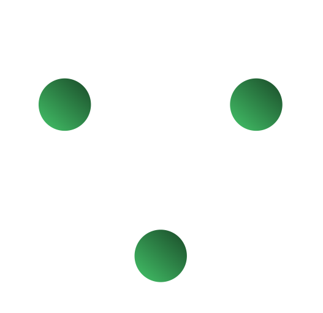
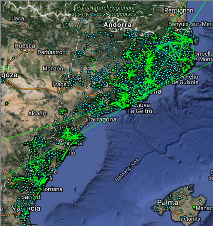
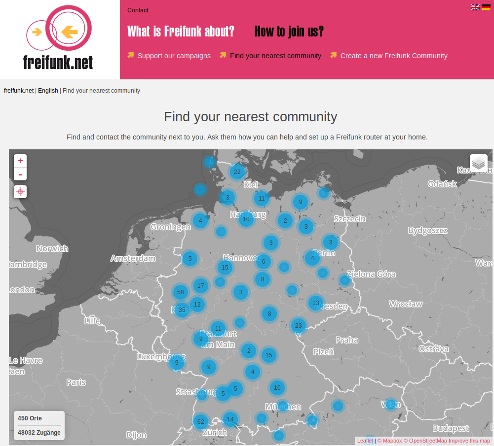
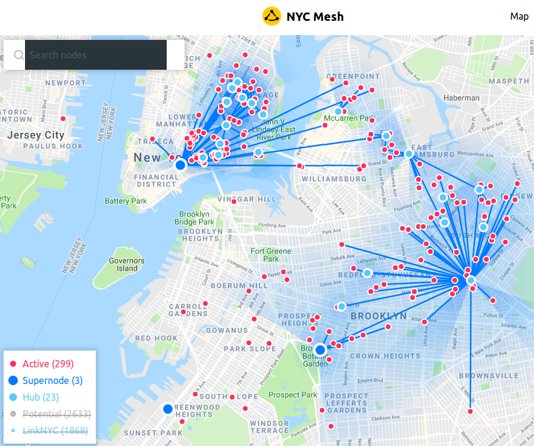
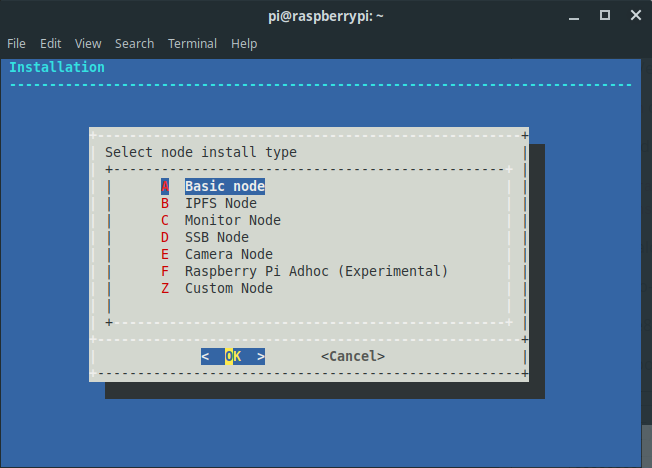
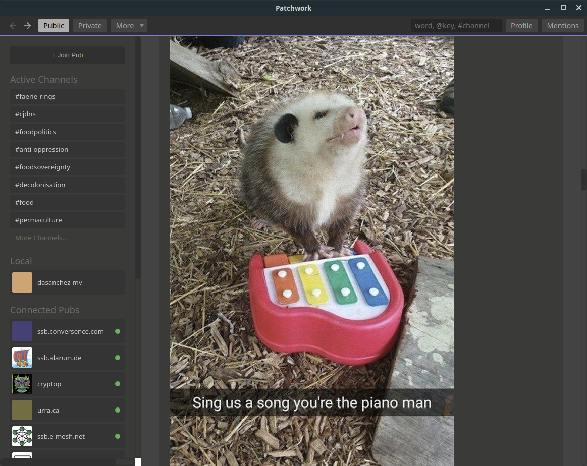
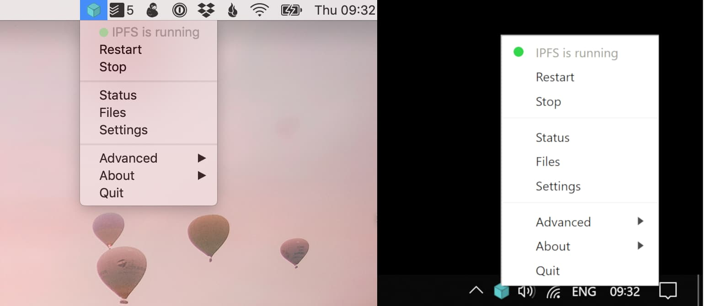
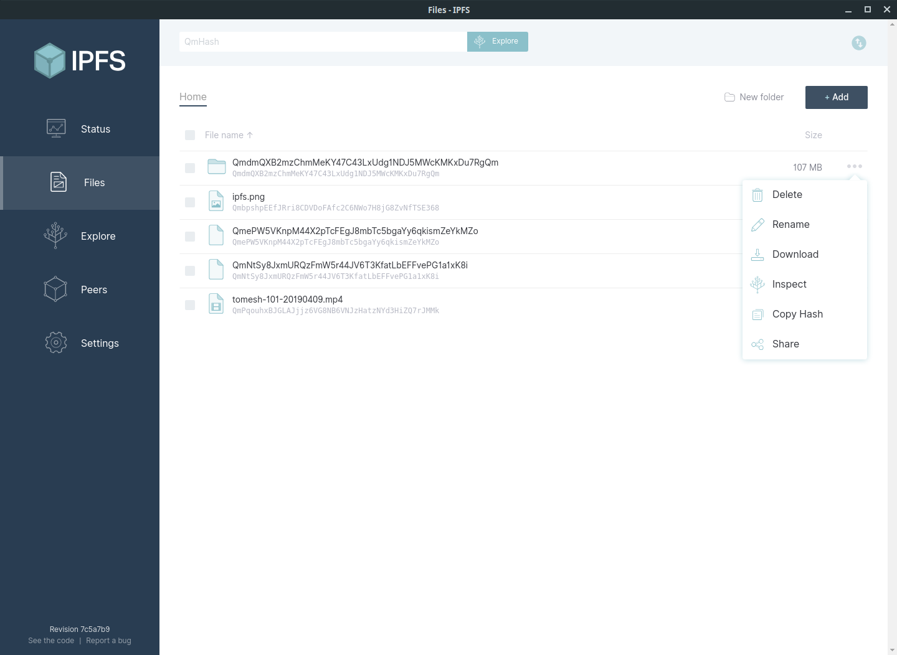

title: Peer-to-Peer Networks
subtitle: An Introduction
class: animation-fade
layout: true

---

class: center, middle

# Peer-to-Peer Networks

## An Introduction

---

class: center, middle

  

    
Hello
my name is
  

  
Dante

  

???

---

class: center, middle

# Toronto Mesh

???
Toronto Mesh is a group of volunteers that was started at CivicTechTO in early 2016.

Our work includes, among other things, building hardware and software solutions for networking applications,

and organizing outreach activities that focus on technical literacy.

---

# Agenda

## 1. Centralized Networks

## 2. Peer-to-Peer Networks

## 3. Toronto Mesh

## 4. Hands-On Activity

???

I have broken up the presentation into four sections:

First, I will talk about centralized network models and the challenges they present.

Then, I will go over some of the solutions being explored to address them,

in the form of peer-to-peer models.

I will then talk about the work we do at Toronto Mesh,

and finally, we will have a hands-on activity to demonstrate a couple of platforms

for messaging and media sharing.

---

class: center, middle

# What Makes Up A Network?

## Infrastructure
## Services
## Community

---

class: center, middle

# Infrastructure

???
Let's start with infrastructure.

When I say "infrastructure" I mean everything that lives on the physical layer:

---

class: center

## Infrastructure

<!--  -->

Fiber Construction by <a href="https://commons.wikimedia.org/wiki/File:Bush_Terminal_Industry_City_Fiber_Construction_2016.jpg">Stealth Communications</a>, licensed under CC BY-SA 4.0
 
Antennas on Towers by <a href="https://commons.wikimedia.org/wiki/File:Collocated_antennas_on_towers.jpg">julianq</a>, licensed under CC BY-SA 3.0
 

???
Cables, fibre, radios, antennas.

---

class: center, middle

# Services

???
Let's move on to services.

When I say "services, " I mean everything that lives on the digital layer:

---

class: center, middle

## Services

 

Wikipedia logo by <a href="https://en.wikipedia.org/wiki/File:Wikipedia-logo-v2.svg">Anomie</a>, licensed under CC BY-SA 3.0
 
Email icon by <a href="https://commons.wikimedia.org/wiki/File:TK_email_icon.svg">Tkgd2007</a>, licensed under CC BY-SA 3.0
 

???
or things we can call software: apps, websites, desktop programs, ones and zeros.

---

class: center, middle

# Community

???
Lastly, a network needs a community: without people using it,

technology has no purpose!

By community, I mean any group of people: our family, our friends,

our neighbourhood, or even our city!

---

class: center, middle

# Centralized Networks

???
What does the Web look like today?

---

class: center, middle

Centralized Infrastructure

# Internet Service Providers (ISPs)

# Governments

???
Most of the infrastructure that we use to go online is managed by Internet Service Providers (ISPs),

and in many cases, regulated by a government authority.

--

## Censorship - Surveillance

???
Both of them may engage in censorship and surveillance.

---

class: center, i-censorship

Centralized Infrastructure: Censorship

https://www.visualcapitalist.com/internet-censorship-map/

???
Censorship at the infrastructure level is mostly dictated and carried out by government agencies.

This is a flowchart the Chinese government uses to assess online content.

Certain governments have opted for shutting down internet access altogether

in times of civil unrest.

---

class: center, i-surveillance

Centralized Infrastructure: Surveillance

https://arstechnica.com/tech-policy/2017/03/senate-votes-to-let-isps-sell-your-web-browsing-history-to-advertisers/

???
Surveillance covers all types of data collection, whether it's for profit or for social control.

---

class: center, middle

Centralized Services

<i class="fab fa-facebook"></i>
<i class="fab fa-twitter"></i>
<i class="fab fa-instagram"></i>
<i class="fab fa-tumblr"></i>
<i class="fab fa-linkedin-in"></i>
<i class="fab fa-reddit"></i>
<i class="fab fa-pinterest"></i>
<i class="fab fa-whatsapp"></i>
<i class="fab fa-slack"></i>
<i class="fab fa-dropbox"></i>
<i class="fab fa-google-drive"></i>
<i class="fab fa-youtube"></i>

???
Think of the websites you visit and the apps you use on your phone.

--

## Control - Censorship - Surveillance

???
Many of these services are controlled by centralized systems

that may also engage in censorship and surveillance practices.

---

class: center

Centralized Services: Control

<i class="fab fa-google huge-icon"></i><i class="fab fa-facebook huge-icon"></i><i class="fab fa-amazon huge-icon"></i>

https://staltz.com/the-web-began-dying-in-2014-heres-how.html  
https://bdtechtalks.com/2017/10/27/why-does-the-centralized-internet-suck/  
https://techcrunch.com/2017/07/28/aws-wont-be-ceding-its-massive-market-share-lead-anytime-soon/ 

???
Google, Facebook, and Amazon have come to dominate the services that support the internet.

Google processes more than 5 billion queries per day.

Facebook has more than 2 billion monthly active users.

Amazon controls over one third of all cloud infrastructure services.

Market dominance has turned these companies into gatekeepers of information,

so we have to trust them to use their power fairly and responsibly...but they don't.

In fact, all of them have huge financial incentives to not only monitor our behaviour,

but also manipulate it whenever possible.

---

class: center, s-censorship

Centralized Services: Censorship

https://www.businessinsider.com/flemish-museums-mocked-facebook-for-censoring-peter-paul-rubens-nudes-2018-7

???
Think about the power they yield when it comes to content moderation and censorship- 

we are relying on businesses to dictate when content should

and should not be blocked.

This power has been noticed by governments, and they have started to get more involved in the

conversation regarding online content.

---

class: center

Centralized Services: Surveillance

https://en.wikipedia.org/wiki/PRISM_%28surveillance_program%29  
https://www.telegraph.co.uk/technology/social-media/9780565/Facebook-terms-and-conditions-why-you-dont-own-your-online-life.html

???
As of right now, these online platforms not only claim ownership of our personal data, but 

also share it with governments agencies and marketing firms.

---

class: center, middle

Communities in Centralized Networks

## Users = Subscribers ($$$!)

???
How do we join an online communities, and how do we communicate today?

We visit a website for a popular platform and sign their terms of service,

then we go ahead and form or join facebook or whatsapp groups.

We become redditors, Twitter followers or Youtube subscribers.

It doesn't matter the platform, we turn into a monetization target 

for any given tech giant.

---

class: middle, center

# Peer-to-Peer Networks

???
So, we have identified some issues. What can we do about them?

How can we do better than today's networks?

---

class: center, middle

## Key Terms

### > Open Source

### > Peer-to-Peer

### > Mesh Networks

???

Before I go over some alternatives, I need to define some of the terms I will use.

---

class: center

# <i class="fab fa-osi"></i> Open Source

### A product or service includes permission to use its source code, design documents, or data

#### Examples:

## Linux Operating System

## Toronto Mesh

https://www.kernel.org/  
https://github.com/tomeshnet/documents/tree/master/governance 
https://github.com/tomeshnet/p2p-internet-workshop

???
The first one is the concept of open source.

Open source means the data for a given product or service is available for study,

analysis, or even modification.

This can apply to just about any area- software, hardware, or even governance.

One example is the governance documents and workshop materials

that Toronto Mesh makes available to the public. 

---

class: center

# <i class="fas fa-users"></i> Peer-to-Peer (P2P)

### Members work and communicate with one another without a central authority

#### Examples:

## BitTorrent Protocol

## RideAustin

https://www.rideaustin.com/  
https://en.wikipedia.org/wiki/BitTorrent

???
The next term is **peer-to-peer**.

In a peer-to-peer system, members of a group or network can communicate with one another,

instead of relying on a centralized service.

One example is RideAustin, a ride-sharing co-op that links passengers directly to vehicle operators.

---

class: center

#  Mesh Networks

### Nodes connect to as many other nodes as possible, and cooperate with one another to efficiently transmit data back and forth.

#### Examples:

## Guifi.net
## Freifunk

https://en.wikipedia.org/wiki/Mesh_networking

???
Last is the concept of a Mesh Network.

Members of a mesh network, also called nodes, connect to as many other nodes as possible,

and cooperate with one another to efficiently transmit data back and forth.

Let's take a look at a couple of content access models to see how this idea can work in practice.

---

class: center, isp-monopoly

Mesh Networks

### Access model: ISP <> Content

???
This is an over-simplified version of how we access the internet today. 

We connect to an ISP, and in turn they connect us to an content provider. 

What would it look like with a mesh network?

---

class: center, isp-mesh

Mesh Networks

### Access model: Mesh <> ISP <> Content

???
This is just one option:

Using a mesh network, only a few computers require an internet connection,

and all of its members can still access outside content.

With these ideas in mind, let's go over some examples of peer-to-peer infrastructure.

---

class: center, middle

Peer-to-Peer Infrastructure

## Ownership Models

### > Community Networks 
### > Public Sector

???
Communities are exploring different ownership models for infrastructure.

Some are leveraging mesh technologies to build networks based on their needs, 

while others are pushing local governments to provide affordable internet access.

---

class: center

Peer-to-Peer Infrastructure

### Community Networks

https://www.nycmesh.net/map  
https://freifunk.net/en/how-to-join/find-your-nearest-community/

???
Two examples of community networks are Freifunk and NYCMesh.

Freifunk is a non-commercial grassroots initiative to support free computer networks in Germany.

NYCMesh is a non-profit project of the Internet Society,

and it is a hybrid network composed of wireless antennas, ethernet, and mesh.

Having control of a network at the community level lowers the incentive

for discriminating against network traffic,

and it makes censorship and surveillance harder to conduct.

---

class: center, middle

Peer-to-Peer Services

## > Peer-to-peer **Protocols**

???
That covers infrastructure, how about services?

I will talk about a couple of open source projects that aim to deliver an alternative

to centralized platforms- and instead of services, I will focus instead of protocols.

---

class: center, middle

Peer-to-Peer Protocols

### **Protocol**: A system of rules that allows entities in a communications system to transmit information

#### Examples: 

## > English language
## > TCP/IP

???

What is a protocol? In this context, it's a set of rules that computers in a network use

to talk to one another.

---

class: center, isp-mesh

Peer-to-Peer Protocols

### Access model: Mesh <> ISP <> Content

???
Think about how we publish and access content on social networks.

Let's go back to our earlier model for content access.

Say a friend of yours posts a photo on facebook.

Facebook will add that post to your feed, and you'll see it next time you log in.

Can we think of another way to share our data?

---

class: center, mesh-content

Peer-to-Peer Protocols

### Access model: Mesh + P2P Content

???
Using peer-to-peer protocols, we are able to do away with centralized services

and share content directly with one another.

One such protocol is called Scuttlebutt.

---

class: center, middle

Peer-to-Peer Protocols

# Scuttlebutt

## A secure gossip platform

https://www.scuttlebutt.nz/

???
Scuttlebutt is a protocol for secure communications,

on top of which different kinds of applications can be built.

---

class: center, middle

Peer-to-Peer Protocols

# Scuttlebutt

### Offline-friendly

### No central server

### No central database

???
Applications that work well offline and that no one person can control

Scuttlebutt clients connect to their peers to exchange information- 

this means I hold my friends' data and they hold mine.

Because there are no central servers, 

it is much harder to collect data on a massive scale

There is no "company" for a tech giant to buy, and no single database

for governments to data mine.

---

class: center, patchwork

Peer-to-Peer Protocols

https://github.com/ssbc/patchwork

???
There are many clients for the scuttlebutt protocol, 

and this is one of them, it's called "Patchwork".

---

class: center

Peer-to-Peer Protocols

https://ssbc.github.io/scuttlebutt-protocol-guide/  

???
The computer that you use for Scuttlebutt will hold your identity,

your data, and your friends' data. 

This chart shows how the feeds from your network are handled in Patchwork by default:

Each line and arrow represents a "following" relationship. With me at the centre,

the people I follow are one hop away from me,

and the people they follow are two hops away from me.

Patchwork pull data from feeds up to three hops away from me, but it will only show me the 

data of two hops away (so I can see my friends' and my friends' friends' posts).

---

class: center, middle

Peer-to-Peer Protocols

# Scuttlebutt Requirements

## > Software

### Patchwork (and many others) on desktop
### Manyverse on mobile

## > Peers (+ Pubs)

https://www.scuttlebutt.nz/applications.html  

???
You can install patchwork, patchbay, or patchfoo on your computer,

or manyverse on your phone.

To follow people, you have two options:

- Open the client software while you are on the same network (wired or wireless)

so you can see each other.

- Get an invite to join a "Pub" you can both connect to.

A Pub is a public peer that follows users to improve uptime and availability.

---

class: center, content-sharing

Peer-to-Peer Protocols: Content Sharing

http://www.chriswatterston.com/blog/my-there-is-no-cloud-sticker

???
Can we apply the same concept to other online services?

How about file sharing?

---

class: center, middle

Peer-to-Peer Protocols: Content Sharing

# IPFS

## A peer-to-peer hypermedia protocol

https://ipfs.io

???
The Interplanetary File System (or IPFS for short) is a protocol we use

to host and share files. 

If I share a file with a friend through IPFS, a second friend

can download it from both of us at the same time.

---

class: center, ipfs-desktop

Peer-to-Peer Protocols: Content Sharing

https://github.com/ipfs-shipyard/ipfs-desktop

???
Just like with Scuttlebutt, there are several clients built on top of the IPFS protocol.

Here is a screenshot of an IPFS Desktop app. It allows you to share and download files-

---

class: center, ipfs-content

Peer-to-Peer Protocols: Content Sharing

???
I was playing with that app when I was putting this presentation together, and

I found an image dataset from the Apollo missions and a collection of XKCD comics through it.

---

class: center, middle

Peer-to-Peer Protocols

# IPFS Requirements

## > Software

### IPFS Desktop, Orion

## > Peers

---

class: center, middle

Communities in Peer-to-Peer Networks

## Users = Stakeholders

---

class: center, middle

Communities in Peer-to-Peer Networks

# Requirements

## 1. Awareness

## 2. Education

## 3. Engagement

???
So, how do we prepare a community for tomorrow's web?

First off, we need people to become aware of the issues we have seen.

This may be as simple as finding out how online services

and governments treat our data.

Developing literacy is the next step-

Maybe you want to become familiar with government policy,

build some networking know-how,

or research the business model of your favourite social network.

Finally, a community can begin working on changes-

they may opt for adopting less intrusive services,

pushing for adequate legislation, or even building a network!

---

class: middle, center

# Toronto Mesh

Bringing it all together

???
OK so we've covered the ingredients for a better Web.

So, where does Toronto Mesh fit in?

---

class: center, hardware

Toronto Mesh: Infrastructure

https://github.com/tomeshnet/prototype-cjdns-pi

???
I'll start with infrastructure- 

we have developed a platform using with open source software,

that people can use as as a reference to build a mesh network.

On the hardware side, a Toronto Mesh node consists of a single board computer 

and a mesh-enabled wifi dongle, like those shown in the picture.

---

class: center

Toronto Mesh: Protocols

 

https://github.com/tomeshnet/prototype-cjdns-pi

???
For protocols, the platform has a number of modules to choose from-

you can pick one or two networking protocols to route and encrypt traffic,

whether to install Scuttlebutt and IPFS,

and a variety of monitoring tools.

The screenshot on the right shows the landing page for one of the nodes I have running at home.

---

class: tomesh-events

Toronto Mesh: Community

https://tomesh.net/events/  
https://github.com/tomeshnet/p2p-internet-workshop

???
On the community side, 

We hold monthly meetups where we bring together people looking to join a network,

and help them better understand the technology of our node platform.

Free Geek Toronto deserves a shout out-

they have been hosting meetups for over a year now. 

Last year, we conducted a six-week course at Fort York Library, 

where participants learned about networking infrastructure,

peer-to-peer applications, and how to organize community networks.

---

class: center, tomesh-networks

Toronto Mesh: Community

https://tomesh.net/map/  
http://meshwithme.online

???
At this stage, we don't have a permanent wireless link between any two nodes,

so our mesh is linked through the internet. 

The site on the right shows all the nodes connected to the Toronto Mesh at any given time.

Which brings us to our last section-

---

class: middle, center

# Toronto Mesh and You

???
Toronto Mesh and You!

If you are interested in joining our group, there are tons of things to do.

---

class: center, middle

Toronto Mesh

## Join us!

### Community Engagement

???
Maybe you can help us grow awareness around peer-to-peer networks

and alternatives to centralized systems.

--

### Deployment

???
Maybe you want to host a mesh node at your home or office to help us

test and grow the network. If we're lucky, you will be within range of an existing node.

--

### Tech Development

???
If you're into the technical stuff, we have lots of ideas to implement

on both hardware and software.

--

### Design

???
We also have a healthy backlog of design-related tasks, from branding and website design

to stickers and educational materials.

---

class: center, middle

# Hands-on Activity:

## P2P Networks Quick Dive

---

class: center, middle

P2P Networks Quick Dive

# Online P2P

## Laptop required

---

class: center, middle

P2P Networks Quick Dive

## Secure Scuttlebutt

## https://www.scuttlebutt.nz/getting-started

---

class: center, middle

P2P Networks Quick Dive: Secure Scuttlebutt

## 1. Install and open Patchwork

### http://dinosaur.is/patchwork-downloader/

### Windows, macOS, and Linux welcome

---

class: center, middle

P2P Networks Quick Dive: Secure Scuttlebutt

## 2. Create identity

---

class: center, middle

P2P Networks Quick Dive: Secure Scuttlebutt

## 3. Connect with local peers
(Or join a pub)

<!-- "urra.ca:8008:@UXWSpZFeRfVTRy4zBu6CU2QA+J3rQyp4IWcHcac9TGg=.ed25519~qSL9CUR4RwC82jDXZecSNFgesjIGE2dU3ol/AgPNdz4=" -->

---

class: center, middle

P2P Networks Quick Dive: Secure Scuttlebutt

## 4. Post a message!

(It can be public or private)

---

class: center, middle

P2P Networks Quick Dive

## IPFS

## https://ipfs.io/

---

class: center, middle

P2P Networks Quick Dive: IPFS

## 1. Install IPFS Desktop

## https://github.com/ipfs-shipyard/ipfs-desktop

---

class: center, middle

P2P Networks Quick Dive: IPFS

### 2. Open the Files window

---

class: center, middle

P2P Networks Quick Dive: IPFS

### 3. Add file to IPFS

Anything goes:

- Text
- Image
- Audio
- Video
- Websites

---

class: center, middle

P2P Networks Quick Dive: IPFS

### 4. Share the hash!

---

class: center, middle

## Thank You!

### <i class="fas fa-link"></i> tomesh.net

### <i class="fas fa-comments"></i> chat.tomesh.net

### <i class="fab fa-twitter"></i> @tomeshnet

???
Thank you!
