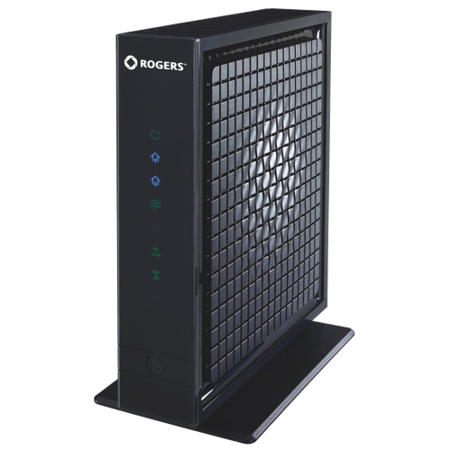
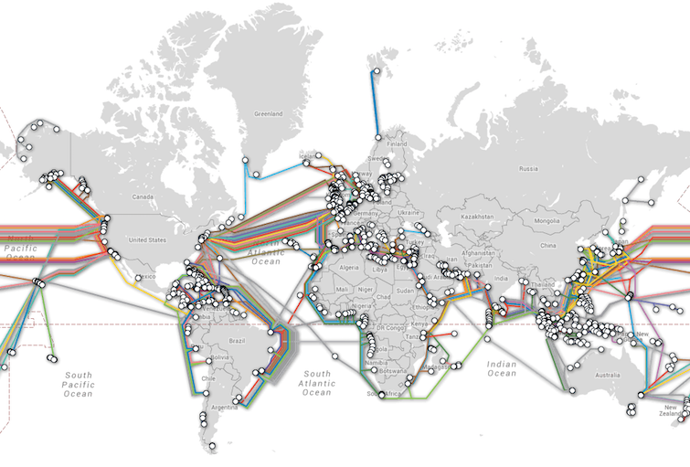

<!SLIDE bullets>
# Today's agenda #

* .callout Why a community mesh?

* Hardware platform based on our Raspberry Pi router

* Routing protocols and the cjdns software

* Get our hands dirty and hack something together :)

<!SLIDE>

<!SLIDE>
# How we access the internet #

<!SLIDE>
# How we access the internet #

**Computer** --❓--> **ISP black box** --> ❓

<!SLIDE>
# How we access the internet #

<!SLIDE>
# How we access the internet #

**Phone** --❓--> **SIM card** --> ❓

If something goes wrong... 📞 **technical support!**

<!SLIDE>
# Data behind the scene #

**Last-mile network** and **[long-range communication cables](http://submarinecablemap.com)**

~~~SECTION:notes~~~

* Business incentive (and right) to maintain control over this huge infrastructural investment they have put in early on

* Black-box this whole thing, users having little visibility and influence over their monopolized platform

* Information access as basic human right, monopoly misaligned with user-interest

~~~ENDSECTION~~~

<!SLIDE>
# Network topology and ownership #

~~~SECTION:notes~~~

* Number of edges to each node

* Ownership of a link is negotiated between the two nodes (peering)

* Why a mesh? Because the topology is especially well suited to distributed ownership model

~~~ENDSECTION~~~

<!SLIDE bullets>
# Your internet experience #

Depends on:

* Economic conditions
* Geographical location
* Government policies
* Corporate interest
* Exclusive memberships

<!SLIDE bullets>
# Your internet experience #

How about...?

* Economic conditions -> **Equal levels of access**
* Geographical location -> **No geo-blocking**
* Government policies -> **No self-serving censorship**
* Corporate interest -> **Effect influence aligned with your interests**
* Exclusive memberships -> **Open protocol and FOSS implementations**
