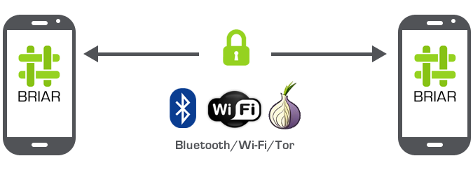

title: Intro to Peer-to-Peer Networks
class: animation-fade
layout: true

---

class: center, middle

# Intro to Peer-to-Peer Networks

---

class: center, middle

<div class="sticker">
  <div class="sticker-upper-region">
    <div class="sticker-hello">Hello</div>my name is
  </div>
  <div class="sticker-name">Dante</div>
  <div class="sticker-lower-region"></div>
</div>

---

# Intro to Peer-to-Peer Networks

???

Today I will introduce you to the world of peer to peer networks. 

--

## 1. What makes up a network?


???

First off, when I say network, I am referring to computer networks.

I will first establish a common frame of reference

by answering the question "what makes up a network?"

--

## 2. Network models

???

Then I will talk about two models we can use categorize networks.

--

## 3. Peer-to-peer networks

???

Afterwards, I will present a few examples of peer-to-peer technologies in use today.

--

## 4. Hands-On with Beaker

???

One of those examples is Beaker, a browser that allows you to

publish websites and share files directly from your computer.

I will run a demonstration of Beaker that you will be able to

follow along from your computer.

--

##  50% Lecture, 50% Interaction 👥

???

I will cover the first three items in the first twenty minutes,

and I will set ten minutes aside to answer questions you may have at that point.

During the second half of the hour, I would like for us to create and publish a website together.

If everything goes well, we will be able to share our creations with one another through chat.

---

class: center, middle

# What Makes Up A Network?

## Infrastructure
## Services
## Community

???

So going back to number 1: What makes up a network? 

I will go over three main components: infrastructure, services, and community.

---

class: center, middle

# Infrastructure


???
First is "infrastructure": 

I use this term when I refer to any object that lives on the physical layer:

---

class: center

## Infrastructure

<div class="slide-label">

</div>

<div class="img-dual">


</div>

<div class="bottom-url">
Fiber Construction by <a href="https://commons.wikimedia.org/wiki/File:Bush_Terminal_Industry_City_Fiber_Construction_2016.jpg">Stealth Communications</a>, licensed under CC BY-SA 4.0
</br>
Antennas on Towers by <a href="https://commons.wikimedia.org/wiki/File:Collocated_antennas_on_towers.jpg">julianq</a>, licensed under CC BY-SA 3.0
</br>
</div>

???
This includes everything from underground cables and fibre bundles,

to radios and antennas, and everything in between, such as

network switches and data centres.

---

class: center, middle

# Services


???
Next up is services.

When I say "services, " I mean everything that runs on the digital layer:

---

class: center, middle

## Services


<div class="img-dual">

 
</div>

<div class="bottom-url">
Wikipedia logo by <a href="https://en.wikipedia.org/wiki/File:Wikipedia-logo-v2.svg">Anomie</a>, licensed under CC BY-SA 3.0
</br>
Email icon by <a href="https://commons.wikimedia.org/wiki/File:TK_email_icon.svg">Tkgd2007</a>, licensed under CC BY-SA 3.0
</br>
</div>

???
or things we can call software: apps, websites, desktop programs, ones and zeros.

---

class: center, middle

# Community


<p>

</p>

<div class="bottom-url">
  <a href="https://www.flickr.com/photos/61434460@N03/5624774486">"Lego Family"</a><span> by <a href="https://www.flickr.com/photos/61434460@N03">the great 8</a></span> is licensed under <a href="https://creativecommons.org/licenses/by/2.0/?ref=ccsearch&atype=html" style="margin-right: 5px;">CC BY 2.0</a>
</div>

???
Lastly, a network needs a community: without people using it,

technology simply has no purpose!

By "community", I mean any group of people: our family, our friends,

our neighbourhood, or even a city!

---

class: center, middle

# Network Models

## Centralized

## Peer-to-peer

???

With those three components in mind, let's talk about two network models:

centralized and peer-to-peer.

---

class: center, middle

# Centralized Network

### A network is organized and controlled by a central authority


???

In a centralized model, a network is organized and controlled

by a central authority that makes decisions on behalf of the whole network.

---

class: center, middle

# Peer-to-Peer (P2P) Network

### Members work and communicate with one another without a central authority


???

In a peer-to-peer system, members of a network can

(and pretty much have to) communicate with one another,

instead of relying on a central authority.

---

class: center, middle

## Centralized & P2P Models

<p>


</p>

<div class="bottom-url">
  <a href="https://www.flickr.com/photos/26474941@N00/4260498576">"Pure Mathematics"</a><span> by <a href="https://www.flickr.com/photos/26474941@N00">edbrambley</a></span> is licensed under <a href="https://creativecommons.org/licenses/by-sa/2.0/?ref=ccsearch&atype=html" style="margin-right: 5px;">CC BY-SA 2.0</a></br>
  <a href="https://www.flickr.com/photos/32104790@N02/4011208734">"Salford Business School students"</a><span> by <a href="https://www.flickr.com/photos/32104790@N02">University of Salford</a></span> is licensed under <a href="https://creativecommons.org/licenses/by/2.0/?ref=ccsearch&atype=html" style="margin-right: 5px;">CC BY 2.0</a>
</div>

???

In order to better contrast these two models, I want to use a couple of analogies

outside of computer networks.

One of them is a learning community. On one side, we have a lecture,

which in this case represents the centralized model.

There is a teacher, or a professor, who is deemed the authority able to teach that class.

On the other side, we have a study group, where a few students, or peers,

may discuss problems, challenging concepts, and share tips for quizzes and exams.

---

class: center, middle

## Centralized & P2P Models

<p>


</p>

<div class="bottom-url">
  <a href="https://www.flickr.com/photos/13286453@N00/5176276604">"restaurant interiour"</a><span> by <a href="https://www.flickr.com/photos/13286453@N00">zoetnet</a></span> is licensed under <a href="https://creativecommons.org/licenses/by/2.0/?ref=ccsearch&atype=html" style="margin-right: 5px;">CC BY 2.0</a>
</br>
<a href="https://www.flickr.com/photos/35034347371@N01/13491186">"Slow Food Vancouver Potluck May 10, 2005 - 16"</a><span> by <a href="https://www.flickr.com/photos/35034347371@N01">roland</a></span> is licensed under <a href="https://creativecommons.org/licenses/cc0/1.0/?ref=ccsearch&atype=html" style="margin-right: 5px;">CC0 1.0</a>
</div>

???

How about meeting friends for lunch? Let's think of two options:

Going out to a restaurant (again, a centralized model) means there is a place

that offers an established menu and hopefully great service, for a price.

A peer-to-peer alternative would be having a pot luck- you invite your friends

to your home and each person contributes with something different. In the restaurant,

you get to order whatever you feel like, but when it comes to a pot luck, you and your

friends need to coordinate what everybody will bring. There is also the matter of 

hosting the get-together and doing all the tidying up before and after the event...

or maybe you just decide to meet in a park.

---

class: center, middle

## Centralized & P2P Models

### Is one better than the other?

???
I should mention that even though I am about to point out some issues

with systems that use centralized model, I am not saying

that one model is always better than the other. 

As we have seen in the previous examples,

centralized models work very well for many applications.

---

class: center, middle

# Peer-to-Peer Networks

???

With that in mind, let's take a look at how the network components we

covered earlier approach the two models.

I will compare a centralized version with a

peer-too-peer one. Keep in mind that much like in the "non-computer" examples,

the two options might not be exactly equivalent.

---

class: center, middle

<div class="slide-label">

<div>Centralized Infrastructure</div>
</div>

# Internet Service Providers (ISPs)

???
Let's start with infrastructure. Most of the infrastructure that we use to go online

uses a centralized model, where access is managed by Internet Service Providers (ISPs),

and in many cases, regulated by a government authority.


--

## Problems?

???
It turns out most of today's problems with ISPs revolve around access,

and most of them are a result of government policy,

depending on where in the world you are.

---

class: center, i-censorship

<div class="slide-label">

<div>Centralized Infrastructure</div>
</div>

<div class="bottom-url">
https://www.visualcapitalist.com/internet-censorship-map/
</div>

???
If you happen to be in a country where the government takes an

active role in filtering the online content available to the public,

the infrastructure itself becomes a tool for censorship (or

blocking access to content).

This is a flowchart the Chinese government uses to assess online content.

---

class: center, i-shutdown

<div class="slide-label">

<div>Centralized Infrastructure</div>
</div>

<div class="bottom-url">
https://www.cbc.ca/news/world/india-kashmir-internet-ruling-1.5422243
</div>

???
Certain governments have opted for shutting down internet access altogether

in times of civil unrest. India regularly shuts down the internet in large parts of the country.

---

class: center

<div class="slide-label">

<div>Centralized Infrastructure</div>
</div>


<div class="bottom-url">
https://blogs.teksavvy.com/sugar-and-bread-why-your-internet-costs-so-much
</div>

???
In Canada, issues with access can take many shapes. Among them, price fixing

by the telecoms who own cable or telephone lines, or a lack of interest in

providing infrastructure to non-urban communities.

---

class: center, isp-monopoly

<div class="slide-label">

<p>Centralized Infrastructure</p>
</div>

### Access model: ISP ↔ Content

???
This is an over-simplified version of how we access the internet today. 

We connect to an ISP, and in turn they connect us to an content provider. 

What would it look like with a peer-to-peer model?

---

class: center, isp-comm-network

<div class="slide-label">

<p>Peer-to-Peer Infrastructure</p>
</div>

### Access model: Community Network ↔ ISP ↔ Content

???
This is one option:

Consider a **community** network, where only a few computers require an internet connection,

and all of its members, or peers, can still access outside content.

Having control of a network at the community level lowers barriers to access with

respect to price and geographic location,

and it makes censorship and surveillance harder to conduct.

With these ideas in mind, let's go over some examples of peer-to-peer infrastructure.

---

class: center

<div class="slide-label">

<div>Peer-to-Peer Infrastructure: Community Networks</div>
</div>


<div class="bottom-url">
https://freifunk.net/en/how-to-join/find-your-nearest-community/
</div>

???

Freifunk is a non-commercial grassroots initiative to support free computer networks

in Germany that was founded in 2003.

Every member in the network provides a wireless router.

People connected to this wireless network can transmit text, music, and movies,

or use services setup by participants to chat, make calls, or play online games. 

Many network members share their internet access and allow others

to use it to access the world wide web.

Local communities provide software adapted to their own needs.

---

class: center

<div class="slide-label">

<div>Peer-to-Peer Infrastructure: Community Networks</div>
</div>


<div class="bottom-url">
http://guifi.net/en/node/2413/view/map
</div>

???

In Spain, Guifi.net started in 2004 as a project in the Catalonia region

to solve the lack of Internet access in rural areas.

Using off-the-shelf WiFi routers, neighbours deployed their own network to interconnect

different locations such as houses, offices, farms, public buildings, etc.

to be able to access the Internet wherever they needed. 

This network has been developed as a common-pool infrastructure. For this reason, anybody,

be it an individual, a non-profit, or a business, can participate in the network-

not only by connecting to it, but also by contributing to its growth and sustainability

by means of the deployment of new links and devices.

This network has grown to over 30,000 members, and members began deploying

fibre optic links as far back as 2010.

---

class: center

<div class="slide-label">

<div>Peer-to-Peer Infrastructure: Community Networks</div>
</div>


<div class="bottom-url">
https://www.nycmesh.net/map
</div>

???

Closer to home, NYCMesh is a community network that offers fast, affordable, and fair access

to the Internet for all New Yorkers. 

NYCMesh community members have wireless routers (also called "nodes")

mounted on a rooftop or balcony to connect to other nodes, forming a network.

"Supernodes" maintained by NYCMesh connect to many other nodes and provide a fast

connection to the rest of the internet.

---

class: center

<div class="slide-label">

<div>Peer-to-Peer Infrastructure: Community Networks</div>
</div>


<div class="bottom-url">
https://www.tomesh.net/map
</div>

???
I will end the section on peer-to-peer infrastructue with this.

This is a map of the Toronto Community Network, currently

being developed by Toronto Mesh along with a couple of partner groups.

The map shows an active supernode at Jane and St. Clair that went up

during the summer of 2020, as well as two proposed ones in East York and

Scarborough. They are supposed to go up in 2021.

I will come back to Toronto Mesh before we break for questions.

---

class: center, middle

<div class="slide-label">

<div>Centralized Services</div>
</div>

<div class="services-grid">

<i class="fab fa-facebook"></i>
<i class="fab fa-twitter"></i>
<i class="fab fa-instagram"></i>
<i class="fab fa-tumblr"></i>
<i class="fab fa-linkedin-in"></i>
<i class="fab fa-reddit"></i>
<i class="fab fa-pinterest"></i>
<i class="fab fa-whatsapp"></i>
<i class="fab fa-slack"></i>
<i class="fab fa-dropbox"></i>
<i class="fab fa-google-drive"></i>
<i class="fab fa-youtube"></i>

</div>

???
For now, let's move on to services.

Think of the websites you visit and the software and apps you use

on your computer and phone.

--

## Problems?

???

Many of these services are owned by companies whose business models

also incentivize censorship and surveillance practices.

---

class: center

<div class="slide-label">

<div>Centralized Services</div>
</div>

<div class="centralized">

<i class="fab fa-google huge-icon"></i><i class="fab fa-facebook huge-icon"></i><i class="fab fa-amazon huge-icon"></i>

</div>

<div class="bottom-url">
https://staltz.com/the-web-began-dying-in-2014-heres-how.html </br>
https://bdtechtalks.com/2017/10/27/why-does-the-centralized-internet-suck/ </br>
https://techcrunch.com/2017/07/28/aws-wont-be-ceding-its-massive-market-share-lead-anytime-soon/ 
</div>

???
Google, Facebook, and Amazon have come to dominate the services that support the internet.

Google processes more than 5 billion queries per day.

Facebook has more than 2 billion monthly active users.

Amazon controls over one third of all cloud infrastructure services- this just means

that they host a lot of websites.

Market dominance has turned these companies into gatekeepers of information,

All of them have huge financial incentives to not only monitor our behaviour,

but also manipulate it whenever possible.

---

class: center

<div class="slide-label">

<div>Centralized Services</div>
</div>


<div class="bottom-url">
https://en.wikipedia.org/wiki/PRISM_%28surveillance_program%29 </br>
https://www.telegraph.co.uk/technology/social-media/9780565/Facebook-terms-and-conditions-why-you-dont-own-your-online-life.html
</div>

???
Many of the biggest online platforms not only claim ownership of our personal data,

but also share it with governments agencies and marketing firms.

---

class: center, i-rcmp-privacy

<div class="slide-label">

<div>Centralized Services</div>
</div>

<div class="bottom-url">
https://thetyee.ca/News/2020/11/16/You-Have-Zero-Privacy-RCMP-Web-Spying/
</div>

???
In some cases, they don't share this data knowingly.

Last November, news came out that the RCMP had purchased

hacking tools to access private friend lists 

of Facebook users. 

---

class: center, isp-comm-network

<div class="slide-label">

<p>Peer-to-Peer Services</p>
</div>

### Access model: Community Network ↔ ISP ↔ Content

???
Let's go back to the earlier model for content access through a community network.

Say a friend of yours posts a photo on facebook.

Facebook will add that post to your feed, and you'll see it next time you log in.

How does a peer-to-peer model would look like instead of this?

---

class: center, mesh-content

<div class="slide-label">

<p>Peer-to-Peer Services</p>
</div>

### Access model: Community Network ↔ P2P Content

???
Using a peer-to-peer model, we are able to do away with centralized services

and share content directly with one another.

These services are independent of infrastructure-

we don't need a community network to do this, 

---

class: center, p2p-content

<div class="slide-label">

<p>Peer-to-Peer Services</p>
</div>

### Access model: ISP Infrastructure ↔ P2P Content

???
we can just as easily go back to a model where many home computers

are hosting content and are still connected to one another through regular ISPs.

---

class: middle, center

# Peer-to-Peer Services

## Messaging

## Social Media

## File Sharing

???
The example services that I will talk about can be roughly 

broken up in three categories: messaging, social media, and file sharing.

---

class: center, middle

<div class="slide-label">

<div>Peer-to-Peer Services: Messaging (<i class="fab fa-whatsapp"></i>,<i class="fab fa-facebook-messenger"></i>)</div>
</div>

# Briar


## A messaging app for anyone who needs a safe, easy, and robust way to communicate

<div class="bottom-url">
https://briarproject.org/
</div>

???
Let's look at messaging first. One peer-to-peer alternative to WhatsApp

and Facebook Messenger is Briar.

Briar is a messaging app designed for activists, journalists,

and anyone else who needs a safe, easy and robust way to communicate.

---

class: center, middle

<div class="slide-label">

<div>Peer-to-Peer Services: Messaging with Briar</div>
</div>




<div class="bottom-url">
https://briarproject.org/how-it-works/
</div>

???
With Briar, messages are synchronized directly between the users’ devices.

If the internet’s down, Briar can sync via Bluetooth or Wi-Fi.

If the internet’s up, Briar can sync via the Tor network, protecting users

and their relationships from surveillance.

Besides messaging, it has support for groups, forums, and blogs.

All the data is saved on your phone, so if you lose access to it, your data is gone too.

---

class: center, middle

<div class="slide-label">

<div>Peer-to-Peer Services: Social Media (<i class="fab fa-facebook"></i>,<i class="fab fa-twitter"></i>)</div>
</div>

# Scuttlebutt


## A secure gossip platform

<div class="bottom-url">
https://www.scuttlebutt.nz/
</div>

???
How about peer-to-peer social media?

Scuttlebutt is a peer-to-peer protocol

that was designed for secure communications,

on top of which different kinds of applications can be built.


---

class: center, middle

<div class="slide-label">

<div>Peer-to-Peer Services: Scuttlebutt</div>
</div>

# Scuttlebutt


### Offline-friendly

### No central server

### No central database

???
Applications that work well offline and that no one person can control.

Scuttlebutt applications connect to their peers to exchange information- 

this means I hold my friends' data and they hold mine.

Because there are no central servers, 

it is much harder to collect data on a massive scale

There is no "company" for a tech giant to buy, and no single database

for governments to data mine.

The computer that you use for Scuttlebutt will hold your identity,

your data, and your friends' data.

---

class: center, middle

<div class="slide-label">

<div>Peer-to-Peer Services: Scuttlebutt</div>
</div>


???
This graph shows how Scuttlebutt pulls content from the network.

The centre of the concentric rings represents your computer.

The people that you follow are the first ring outside,

or one hop away from you.

People that they follow sit two hops away from you, and so on.

By default, Scuttlebutt pulls content from three hops away, but

only shows you posts from two hops away.


---

class: center, patchwork

<div class="slide-label">

<div>Peer-to-Peer Services: Scuttlebutt with Patchwork</div>
</div>

<div class="bottom-url">
https://scuttlebutt.nz/get-started/
</div>

???
There are many clients for the Scuttlebutt protocol, 

and this is one of them: "Patchwork" is a decentralized

messaging and sharing app built on top of Scuttlebutt.

---

class: center, middle

<div class="slide-label">

<div>Peer-to-Peer Services: Social Media (<i class="fab fa-reddit"></i>)</div>
</div>

# Aether


## An app that gives you fresh, new content about the things you’re interested in

<div class="bottom-url">
https://getaether.net/docs/
</div>

???
One peer-to-peer alternative to Reddit that showed up in the last

couple of years is Aether.

With Aether, you can create a community for your friends,

or for strangers that are interested in similar things.

---

class: center, middle

<div class="slide-label">

<div>Peer-to-Peer Services: Aether</div>
</div>


???
All communities are public, and everyone can write to any community.

There are a few differences with respect to Reddit, but the biggest one

for me is that all content disappears after six months.

This is a screenshot I took from its "privacy" community.

---

class: center, content-sharing

<div class="slide-label">

<div>Peer-to-Peer Services: Content Sharing</div>
</div>

<div class="bottom-url">
http://www.chriswatterston.com/blog/my-there-is-no-cloud-sticker
</div>

???
Let's move on to file storage and content sharing.

I like the line of "there is no cloud: it's just someone else's computer",

because it demistifies the notion that if I agree to keep my files on the cloud

they all go to some magic fairyland where they are always safe and

available as long as I have access to the internet.

Let's talk about alternatives to file hosting services such as Dropbox, Google Drive,

or Microsoft's OneDrive.


---

class: center, middle

<div class="slide-label">

<div>Peer-to-Peer Services: Content Sharing (<i class="fab fa-dropbox"></i>,<i class="fab fa-google-drive"></i>)</div>
</div>

# IPFS


## A peer-to-peer hypermedia protocol

<div class="bottom-url">
https://ipfs.io
</div>

???
The Interplanetary File System (or IPFS for short) is a protocol used

to host and share files. 

If I share a file with a friend through IPFS, a second friend

can download it from both of us at the same time.

---

class: center, ipfs-desktop

<div class="slide-label">

<div>Peer-to-Peer Services: IPFS</div>
</div>

<div class="bottom-url">
https://github.com/ipfs-shipyard/ipfs-desktop
</div>

???
Just like with Scuttlebutt, there are several applications built on top of the IPFS protocol.

Here is a screenshot of an IPFS Desktop app. It allows you to share and download files-

---

class: center, ipfs-content

<div class="slide-label">

<div>Peer-to-Peer Services: IPFS</div>
</div>

???
I was playing with that app when I was putting this presentation together, and

I found an image dataset from the Apollo missions and a collection of XKCD comics.

The IPFS protocol is powerful enough that it has even been used to

livestream presentations in real-time.

---

class: center, middle

<div class="slide-label">

<div>Peer-to-Peer Services: IPFS</div>
</div>

# This slide deck is on IPFS!

<h4>https://ipfs.io/ipfs/QmTVP38gb9HpkYgb49GCVbctjHhSEBfwuhfvtFZZRo8RvY</h4>

???
This presentation is available on IPFS at these addresses. You can actually access

this URL from any browser.

---

class: center, middle

<div class="slide-label">

<div>Peer-to-Peer Services: Content Sharing (<i class="fab fa-dropbox"></i>,<i class="fab fa-google-drive"></i>,
<i class="fab fa-aws"></i>)</div>
</div>

# Beaker


## An experimental peer-to-peer Web browser

<div class="bottom-url">
https://beakerbrowser.com
</div>

???
Beaker is an experimental peer-to-peer Web browser.

Users connect directly to your computer to access your files.

Beaker allows you to create "hyperdrives", that can be anything from a single

file, to a dataset, to a Twitter-clone website.

Users that access a hyperdrive can also choose to host it, so that it remains

online even if your computer is off.

---

class: center, beaker-ui

<div class="slide-label">

<div>Peer-to-Peer Services: Beaker</div>
</div>

???
Here is a screenshot of the Beaker Browser. It looks just like any other browser, except

it allows you to publish a website from your computer in three steps:

---

class: center

<div class="slide-label">

<div>Peer-to-Peer Services: Beaker</div>
</div>


???
1. Create a hyperdrive

2. Edit the source code

3. Share the hyperdrive link

Beaker is great for classrooms and offices where you need an easy way

to share Websites without setting up servers or touching the command-line.

We will go into these during the Beaker hands-on shortly.

---


class: center, middle

<div class="slide-label">

<div>Peer-to-Peer Services: Beaker</div>
</div>

# This slide deck is also on Beaker!

<h4>hyper://06bcb9e7f6728a903bce76993652195a67a1114cf900c359c5dcd1bffb7a1459/</h4>

???
This presentation is available via Beaker on this address.

---

class: middle, center

<div class="slide-label">

<div>Peer-to-Peer Services</div>
</div>

## Resilience

## Surveillance

## Content

???

So after all of this, what do peer-to-peer networks, and services in particular, offer?

I will quickly recap what they bring to the table.

---

class: center

<div class="slide-label">

<div>Peer-to-Peer Services</div>
</div>

# 🔼 Resilience


<div class="bottom-url">
https://www.cbc.ca/news/technology/facebook-whatsapp-instagram-social-media-outage-1.5198656
</div>

???

First off, more resilience.

If Google goes down, i cannot get to my spreadsheet.

But if I have distributed copies of this spreadsheet among family and friends,

it doesn't matter if one of their computers is broken or a few of them are turned off.

---

class: center

<div class="slide-label">

<div>Peer-to-Peer Services</div>
</div>

# 🔽 Surveillance


<div class="bottom-url">
https://briarproject.org/how-it-works/
</div>

???

Next, it's harder to conduct surveillance.

Like I mentioned earlier: 

with p2p networks, there is no central database that a company or government

can *easily* mine for personal information. I emphasize *easily*,

and that's why you should almost always use encryption when available.

---

class: center

<div class="slide-label">

<div>Peer-to-Peer Services</div>
</div>

# 🔊 Content 🔇

## Censorship 

# or 

## Content Moderation?

???
Lastly, we have the challenge of content.

There have been many conversations around the role that

centralized social media services play in society when it comes

to allowing content to not only remain available, but actively

pushed to users based on recommendation algorithms.

---

class: center

<div class="slide-label">

<div>Peer-to-Peer Services: Censorship or Content Moderation?</div>
</div>


<div class="bottom-url">
https://www.cbc.ca/news/world/twitter-bans-trump-permanently-1.5867020
</div>

???

This is not an easy challenge to solve, but when it comes to

peer-to-peer networks, content moderation

rests in the hands of the whole network. 

To use Scuttlebutt as an example, my friends consistently block any

users that post abusive or offensive language right away,

so those users and their posts will simply not be propagated in the network

through my friends' machines, or mine, unless I follow those users.

But then again, it all depends on what kind of

community you are trying to build. Speaking of...

---

class: center, middle

# What about communities?

???

I have talked about peer-to-peer infrastructure and services, but what about the

communities?

A community is a critical part of a network, and the main difference when we

talk about centralized and peer-to-peer networks is the role communities play in them.

---


class: center, middle

<div class="slide-label">

<div>Communities in Centralized Networks</div>
</div>

## Users = Subscribers 💵

???
When it comes to centralized systems, think of how we join an online group,

and how we communicate through social media.

We reach out to Rogers, Bell, or any other ISP and

sign up for a monthly plan.

Then we visit a website for a popular platform and agree to their terms of service,

then we go can create a facebook group or join a whatsapp one.

We become Twitter followers or Youtube subscribers.

It doesn't matter the platform, we turn into a monetization target 

for any given tech giant. We provide our personal data and we are rewarded with

access to communication platforms free-of-charge*. 

---

class: center, middle

<div class="slide-label">

<div>Communities in Peer-to-Peer Networks</div>
</div>

## Users = Stakeholders ⛓

???

In a peer-to-peer network, users are empowered to build, contribute, and

make decisions regarding the network.

This is a particular requirement when it comes to physical infrastructure, where

members of a network have a lot to gain by understanding the systems,

tools, and technologies they rely on. There is a certain level of

involvement expected from the peers in a peer-to-peer network.

In the example of the potluck, even if you show up empty-handed

thinking you can just order a pizza, you still need to coordinate

with your friends to make sure no one else is bringing one already.

---

class: center, middle

<div class="slide-label">

<div>Communities in Peer-to-Peer Networks</div>
</div>


# Requirements

???
So, how do we build a peer-to-peer community?

--

## 1. Awareness

???
First we need people to become aware of the issues we have seen.

This may be as simple as finding out how online services

and governments treat our data.

--

## 2. Education

???
Developing literacy is the next step-

Maybe you want to become familiar with government policy,

build some computer networking know-how,

or research the business model of your favourite social network.


--

## 3. Engagement

???
Finally, a community can begin working on changes-

they may opt for adopting less intrusive services,

pushing for adequate legislation, or even building a network!

---

class: middle, center

# Toronto Mesh


Bringing it all together

???
This brings me to Toronto Mesh.

Toronto Mesh is a group of volunteers that was started at CivicTechTO in early 2016.

Our work includes, among other things, building hardware and software solutions

for networking applications, and organizing outreach activities that focus

on technical literacy.

We hold regular meetups where we bring together people looking to join a network,

and help them better understand the technology of our platform.

Please visit tomesh.net to learn more about our efforts.

We are preparing a two-part course on how the internet works and 

building community networks, 

so keep an eye on upcoming TPL workshops.

---

class: center, middle


## Q&A

### <i class="fas fa-link"></i> tomesh.net

### <i class="fas fa-comments"></i> chat.tomesh.net

### <i class="fab fa-twitter"></i> @tomeshnet

### <i class="fab fa-twitter"></i> @dasanc_

???
This is the end of the lecture portion.

Thank you for following along!

Let's set aside ten minutes for questions. If you need

a break before we move on to the Beaker hands-on session this would

be a good time for that too.

Also, feel free reach out afterwards.

I will leave you with these links. You can access the Toronto Mesh

chat at chat.tomesh.net, or you can also find us on Twitter.

My handle is the one at the bottom.

---

class: center, middle

# Beaker Quick Dive

## Computer required

### It's OK if you only want to watch 👍

---

class: center, middle

Beaker Quick Dive

# Beaker Workflow

## Create hyperdrive

## ⬇

## Add content

## ↕

## Publish

???
There are three major steps to publishing a website via Beaker:

You first create a hyperdrive, then you add some content to it,

and then you share the hyperdrive address. As soon as you add a new file

or save changes to an existing one, whoever is looking at your hyperdrive

will be able to reload it to see the changes.

I will point out that if you are using a restrictive network or device,

Beaker traffic might be blocked.

---

class: center, middle

Beaker Quick Dive

## 1. Install and open Beaker

<h1>https://beakerbrowser.com/install/</h1>

### Windows, macOS, and Linux welcome

---

class: center, middle

Beaker Quick Dive

## 2. Create hyperdrive


</br>


???
Click the "New hyperdrive" button below the address bar, on the right side of the window.

Enter a title for the website, and click the Create button.

---

class: center, middle

Beaker Quick Dive

## 2. Create hyperdrive


???
A new hyperdrive will be created, and its contents will be shown on two separate panes.

The pane on the left shows the files in the hyperdrive, and the pane on the right shows

the file in the current path. A file called index.json with the name and description

of the hyperdrive is automatically created, and the pane on the right will prompt us

to create an index.md file or index.html file. Click the "Create an index.md" option.

---


class: center, middle

Beaker Quick Dive

## 3. Create `index.md` file


???
A new index.md file will be created and the name of the hyperdrive will be added

as a heading.

.md files are Markdown files. Markdown is a markup language that helps you add

simple formatting to any text file.

---

class: center, middle

Beaker Quick Dive

## 3. Create `index.md` file

<h3>https://www.markdownguide.org/cheat-sheet</h3>


???
This is the link to a markdown cheat sheet, you can keep it open in a separate tab

for reference.

Add a couple of lines to index.md and enter some text. Just to show some simple formatting,

I can wrap the word Markdown with two stars on each side. That will make it bold.

Press Ctrl+S or click the "Save" button.

---

class: center, middle

Beaker Quick Dive

## 4. Share hyperdrive address


???
We have a website with some minimal content. Let's try publishing it!

Click the dropdown arrow to the right of the star on the address bar, and click 

"Copy URL". This will place the address in your clipboard.

Go to the chat window in crowdcast and copy the address if you would like to share it.

Feel free to add a custom message so you can recognize your site!

---

class: center, middle

Beaker Quick Dive

## 5. Update `index.md` file


---

class: center, middle

Beaker Quick Dive

## 5. Update `index.md` file


---

class: center, middle

Beaker Quick Dive

## 5. Update `index.md` file


---

class: center, middle

Beaker Quick Dive

## 5. Update `index.md` file


---

class: middle

Beaker Quick Dive

## 5. Update `index.md` file

<h3>https://www.markdownguide.org/cheat-sheet</h3>

```
# Hello Beaker!

This is a **Markdown** file.

This is how you insert an image:


This is how you insert a link:

[Link to Toronto Public Library](https://www.torontopubliclibrary.ca/)
```

---

class: center, middle

Beaker Quick Dive

## 5. Update `index.md` file


---

class: middle

Beaker Quick Dive

## 6. Create `index.html` file

```
<!DOCTYPE html>
<html>

<head>
   <link rel="stylesheet" href="styles.css"> 
</head>

<body>

<h1>Hello Beaker!</h1>
<p>We can do HTML as well.</p>

</body>
</html> 
```

---

class: middle

Beaker Quick Dive

## 7. Create `styles.css` file

```
body {
  background-color: peachpuff;
  color: midnightblue;
  font-family: Arial, Helvetica, sans-serif;
}
```

<h3>https://html-color-codes.info/color-names/</h3>

---

class: center, middle

Beaker Quick Dive

## 7. Create `styles.css` file


---

class: center, middle

# Thank you, and happy hacking! 🤓