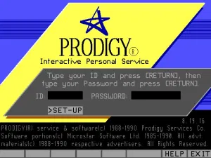
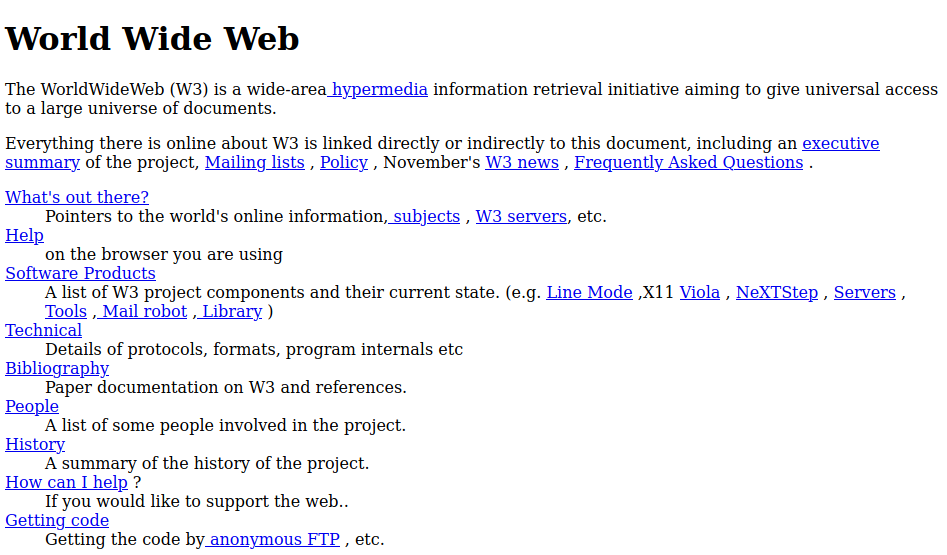
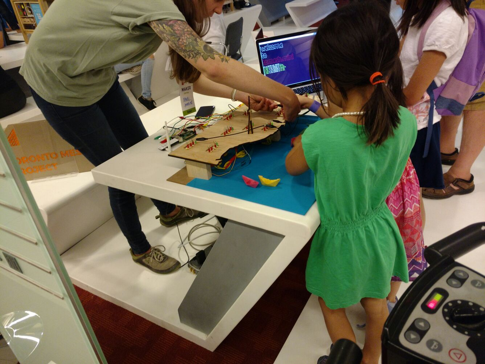
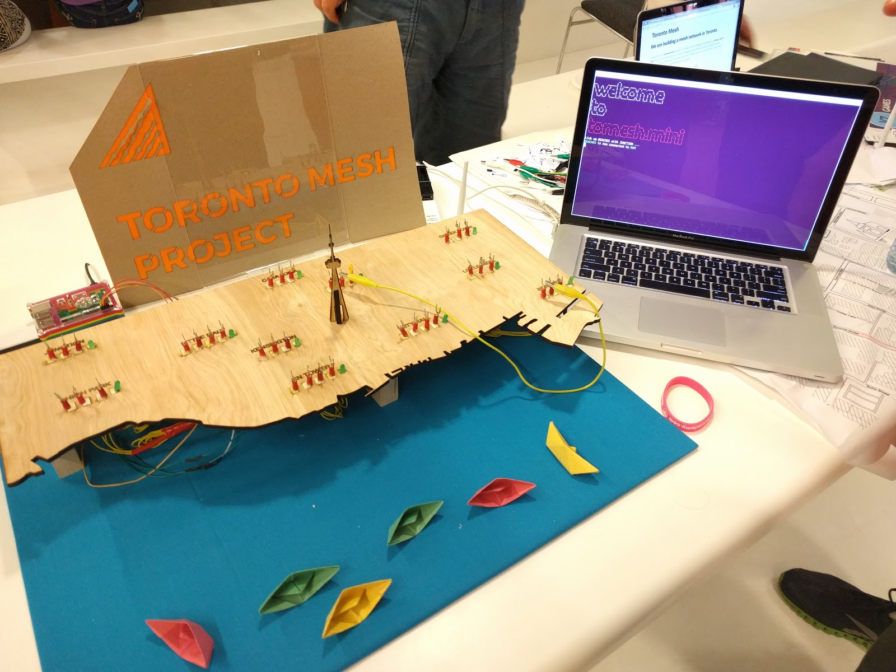
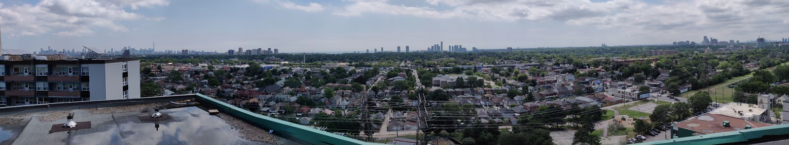

title: How to Reclaim the Internet
class: animation-fade
layout: true

---
class: center, middle

# How to Reclaim the Internet

???
Hello, and welcome to part two of our "what is the internet?" series:

How to Reclaim the Internet.

---
class: center, middle

<hello-sticker name="Ushnish" sticker-color="#b22"></hello-sticker>

---
class: center, middle

<hello-sticker name="Yurko" sticker-color="#82d"></hello-sticker>

---
# How to Reclaim the Internet

???
Let us take a look at the agenda for today's program.

--
## 1. Recap: Who owns the Internet?

???

--
## 2. The commons

???

--
## 3. Digital commons

???
In the last session we talked about who owns our data and the ways in which online services try to collect and use it.

--
## 4. Network infrastructure as commons

???

--
## 5. The Toronto Community Network

---
class: center, middle

# Previously in _Who owns the Internet?_...

???
First, a recap of part one of the series.

---

# Who owns the Internet?

<captioned-image img-file="img/internet-all-together.svg" img-width="40"></captioned-image>

???
We covered how the internet works, talking about the differences between the wires and apps.
The wire app divide

---

# Who owns the Internet?

<captioned-image img-file="img/internet-apps-ownership.svg" img-width="40"></captioned-image>

???
The ISPs own the wires, tech giants such as Google and facebook own the apps.

Both own our data.

We own a small part of the system, mainly the equipment in our homes.

---

class: center, middle

<captioned-image img-file="img/i-was-told.png" img-width="35"></captioned-image>

I was told we waer building anew Internet.
We cant reclaim the internet by replicating the current setup.
---

class: center, middle

# The Commons

???
Lets first talk about the commons, before we get in Digital Commons
---

# What is the "commons"?

## The resources and practices jointly held and shared by all members of a community.

## They are neither privately owned by individuals, or publicly owned by the state.

### also...

???

The land, water bodies, and the atmosphere we depend on for survival can be considered as "commons".

Note that it is not ownership about the government or the state.

In understanding the Digital Commons, remember that its not about private or state

---

# What is the "commons"?

## The _social practice_ of governing a resource not by market or state, but by a **community of users** that self-governs the resource through institutions that it creates.

???
Define what we mean by the commons, and then go into a few examples

How does it address our pressing issues? (from last session)

---

class: center, middle

# 👥 **Can you think of examples of community-owned and maintained spaces?**

???
Prompt: Can anyone think of collectively/community owned and maintained spaces?

---

# Community gardens

<captioned-image img-file="img/circular-bed.jpg" img-width="30" caption='"Circular Bed, Barracks Lane Community Garden" by karenblakeman is marked under CC0 1.0. To view the terms, visit https://creativecommons.org/licenses/cc0/1.0/'></captioned-image>

---

# Community pantries

<captioned-image img-file="img/toronto-pantry.webp" img-width="40" caption="https://www.torontolittlefreepantriesproject.com/"></captioned-image>

???
Community fridges too

---

# Little Free Library

<captioned-image img-file="img/little-library.jpg" img-width="30"></captioned-image>

---

# Farmers markets

<captioned-image img-file="img/farmers-market.jpg" img-width="30" caption="Michael Barera, CC BY-SA 4.0 <https://creativecommons.org/licenses/by-sa/4.0>, via Wikimedia Commons"></captioned-image>
<!-- https://commons.wikimedia.org/wiki/File:Grand_Prairie_May_2019_29_(Grand_Prairie_Farmers_Market).jpg -->

---

# Potlucks

<captioned-image img-file="img/potluck.jpg" img-width="28" caption='"Slow Food Vancouver Potluck May 10, 2005 - 16" by roland is licensed under CC0 1.0. To view the terms, visit https://creativecommons.org/licenses/cc0/1.0/'></captioned-image>

---

# Sustainable commons

## Elinor Ostrom's 8 Design Principles

### 1. Clear boundaries of common resources and membership
### 2. Match rules governing use to local needs
### 3. Those affected by the rules participate in decisions
### 4. Effective system to monitor member behaviour

???
So, what happens if somebody eats all the food, or takes all the plants home?

In order to be sustainable, political economist Elinor Ostrom

identified eight "design principles" of stable commons management.

1> Commons need to have clearly defined boundaries.

In particular, who is entitled to access to what? Unless there’s a specified

community of benefit, it becomes a free for all, and that’s not how commons work.

2> Rules should fit local circumstances. There is no one-size-fits-all approach to

common resource management. Rules should be dictated by local people and local ecological needs.

3> Participatory decision-making is vital. There are all kinds of ways to make it happen,

but people will be more likely to follow the rules if they had a hand in writing them.

Involve as many people as possible in decision-making.

4> Commons must be monitored. Once rules have been set, communities need a way of checking

that people are keeping them. Commons don’t run on good will, but on accountability.

---

# Sustainable commons

## Elinor Ostrom's 8 Design Principles

### 5. Graduated sanctions when rules are violated
### 6. Mechanisms of conflict resolution
### 7. Self-determination respected by external authorities
### 8. Nested tiers of governing enterprises

???

5> Sanctions for those who abuse the commons should be graduated. Ostrom observed that

the commons that worked best didn’t just ban people who broke the rules. That tended to

create resentment. Instead, they had systems of warnings and fines, as well as informal

reputational consequences in the community.

6> Conflict resolution should be easily accessible. When issues come up, resolving them

should be informal, cheap and straightforward. That means that anyone can take their problems

for mediation, and nobody is shut out. Problems are solved rather than ignoring them

because nobody wants to pay legal fees.

7> Commons need the right to organise. Your commons rules won’t count for anything if

a higher local authority doesn’t recognise them as legitimate. 

8> Commons work best when nested within larger networks. Some things can be managed locally,

but some might need wider regional cooperation – for example an irrigation network might

depend on a river that others also draw on upstream.

---

class: center, middle

# Digital Commons

???
The digital commons are a form of commons involving the distribution 

and communal ownership of informational resources and technology.

---

class: center, middle

<captioned-image img-file="img/wikipedia.svg" img-width="25"></captioned-image>

???
Wikipedia is a free, multilingual open-collaborative online encyclopedia

created and maintained by a community of volunteer editors using

a wiki-based editing system.

It is one of the 15 most popular websites as ranked by Alexa, as of January 2021.

---

# What is the "digital commons"?

<captioned-image img-file="img/wikipedia.svg" float="right" img-width="20"></captioned-image>

## The distribution and communal ownership of technology infrastructure and informational resources.

???
Resources are typically designed to be used by the community by which they are created.

Examples of the digital commons include wikis, open-source software, and open-source licensing.

The digital commons provides the community with free and easy access to information.

---

# Open vs. closed protocols

## `http://info.cern.ch`
#### — home of the first website

???
In the 1980s, there were a number of private services such as Prodigy and America Online

whose networking protocols (using standard telephone lines) were closed and proprietary.

Therefore the only services and innovation within those digital realms were seller-authorized

activities that were seen as contributing to the bottom line. When the open standards of

the World Wide Web arrived in the early 1990s and exploded with the release of the Netscape browser,

countless, unanticipated user-driven websites and projects blossomed -- a direct result of
 
an open, shareable protocol. In short order, the top-down, seller-controlled ecosystem

of private vendors was eclipsed by the more versatile, socially accessible commons-based

ecosystem of the Internet.

---

# Software: Linux

<captioned-image img-file="img/tux.svg" img-width="20"></captioned-image>

???
The Linux kernel is a free and open-source operating system kernel.

Linux is deployed on a wide variety of computing systems, such as embedded devices,

mobile devices (including its use in the Android operating system),

personal computers, servers, mainframes, and supercomputers.

---
# Content: Creative Commons

???
Creative Commons (CC) is an American non-profit organization and international network

devoted to educational access and expanding the range of creative works

available for others to build upon legally and to share.

This coveres where we want to frame our discsussion about community networks 

---

class: center, middle

# Network Infrastructure as Commons

???
Play some videos for examples of community networks:

hearing the experience from someone who has experienced it

firsthand is very powerful

Zenzeleni: https://www.youtube.com/watch?v=R9u-hfxAeBo

Detroit: https://www.youtube.com/watch?v=1B0u6nvcTsI

Do we think of network infrastructure, the physical things as a commons? Lets look at what that looks like

---

# What is a "community network"?

## A **community network** consists of communication infrastructure collectively owned and managed by the community, operating under the principles of democratic participation of their members.

#### — adapted from _Cumbre Latinoamericana de Redes Comunitarias, Argentina 2018_
 
???
A community network is a network infrastructure as a commons.

communications infra (towers, antennas, fiber, cableing, support system)

community and members are two important words
Who is in the community? Members are often defined as anyone who uses uses and relies on the services, 
sets up node for others to use, they should all have a say in teh democratic process

---
class: middle

<captioned-image img-file="img/diy-telecoms.png" img-width="45"></captioned-image>

???

DIY telecoms - ISP where communities that are not well served by the big telco create their own connectity

Mexico, South america, Europe, Cuba (Snet - gaming, example)

---
class: middle

<captioned-image img-file="img/zenzeleni.png" img-width="50"></captioned-image>

???
Zenzeleni - Co-operative ISP from South Africa

Local people are the service provider

Not just about calling Rogers or Bell and consuming this thing you buy

You have a say where you want this network to go in the future

I want to volunteer to be a support member, I can help thes houses
---
class: middle

<captioned-image img-file="img/wsj-nycmesh.png" img-width="50"></captioned-image>

???
Closer to home, Young networks maybe 8 years old

Couple of big nodes connecting hundreds of people

Install groups that goto peoples home ot install

Many of these groups participate in policy making 
Push back upstream and represent at places like CRTC

---

# Community networks support

???

Why do we care? Cheaper internet? No! its more then this

--

## Local regenerative economies

???

Community networks support local re-generative connectivity

Its about making sure that the money generated in the process of delivering connectivity
goes back into the people that are operating the network.

Not none-profit or free, but not extracted by a mutli national entity or investor that has very little steak in the city and users

--

## Local capacity to operate infrastructure

???

Build local capacity

If you dont know how it works, you cant have a say about how it should work

Big part in participaing with the community network

IE this sessions and have a way to talk about these thigns

---

<captioned-image img-file="img/working-0.jpg"></captioned-image>

???

Crimping network wires

---

<captioned-image img-file="img/working-3.jpg"></captioned-image>

??? 

Tomesh super node installation

---

# Community networks support

## Local regenerative economies

## Local capacity to operate infrastructure

--

## Practice over consumption of technology

???

CN is a way of thinking about tech that is not just consumption base but practicing it

--

## Neighbours over faceless multinational corporations

???

You deal with your neighbours in the process, not just support line that you will never meet, just want to get rid of you sometimes

---

<captioned-image img-file="img/tomesh-group.jpg"></captioned-image>

???

Peope talking about technologyu and plan the next network itteration

---

<captioned-image img-file="img/dwebcamp-topology.jpg" img-width="50" ></captioned-image>

???

Board at a confrence where peopel are drawing the network

Take something technical and intiminading and turn it into something easly to understand

---

# Enable a different digital future

??? 

Not just about cheap internet

--

## More inclusive and affordable Internet access

???

Allow peopel to participate in the building process

--

## A truly "smart" city of tech-informed residents

???

Not a smart city where everyting is connected by a black box

Its a city where the people that are participating in the city are actaully smart, 
We understand the tradeoffs the make when we do certain digital actions

--

## Local peer-learning and professional development

--

## Prosumers supporting resilient local networks

???

People start supporting the network.

What do you do when the main consumer cant help you? 

---

<captioned-image img-file="img/working-1.jpg"></captioned-image>

???

Photos we are installing

---

<captioned-image img-file="img/working-2.jpg"></captioned-image>

???

Building mounts

---

<captioned-image img-file="img/working-5.jpg"></captioned-image>

???

Antenna we put up

---

<captioned-image img-file="img/working-4.jpg"></captioned-image>

???

Houses undeneat and across can connect to this antenna

---

## Our tech needs more humane relationships

<captioned-image img-file="img/good-server.jpg" float="right" img-width="25"></captioned-image>

### Bring "care" to our digital life

### There is no "market demand" for taking care of our most marginalized communities

???

We care for phopel in our physical life What does it look like int he digital life

---

## Our tech needs more humane relationships

<captioned-image img-file="img/good-server.jpg" float="right" img-width="25"></captioned-image>

### Community networks enable civil society to build equitable access with and for our neighbours

### Build strong human relationships through tech

???

Building human relationships, Hang out, have barbeques (when its not covid)
---

## Experiment with software that respects users

<captioned-image img-file="img/scuttlebutt.png" float="right" img-width="30"></captioned-image>

### Scuttlebutt is a peer-to-peer social network that cannot track user behaviour

### _Free software that prioritizes users does exist!_

???

Owning infra does not solve your data problem but allows you to have conversations

Host each others date, instead of some company hosting everyones

One example of p2p 

Hint at DWeb/P2P future session (aka. Dante’s) as an alternative to address “Web” problems
https://en.wikipedia.org/wiki/Commons#Digital_commons

---

class: center, middle

# _Is there a community network in Toronto?_

---

class: center, middle

# The Toronto Community Network

---

class: center, middle

## _A community network needs_

# Awareness

# Organizing

# Know-how

???

Do people thing network building is all thats needed?

Top two are the hardest

---

class: center, middle

# Toronto Mesh

---

<captioned-image img-file="img/tomesh-events.png" float="right" img-width="24"></captioned-image>

# Toronto Mesh

## Started at Civic Tech Toronto in 2016

## Built open resources and free software used by thousands

## Facilitated local meetups, workshops and events

---

class: middle

???

At Maker Festival at TRL

Kid friendly games

---

<captioned-image img-file="img/tomesh-node.jpg"></captioned-image>

???

Prototypes in public spaces.

Lisgar park showcase of tech at Our Networks.

---

class: center, middle

# Toronto Community Network

---

## Deploy and operate commonly-owned network infrastructure in Toronto

--

## Develop sustainable multi-stakeholder governance of digital infrastructure

--

## Enable broad participation through network literacy programs

???

Whow ones it?
How do we make sure the people that build it today, are not the forever owners?

--

### _Supportive of our city's commitment to the Cities for Digital Rights declaration_

???

Toronto join spearheaded by Amsterdam Barcelona

---

<captioned-image img-file="img/tomesh-map.png"></captioned-image>

???

What we have planned

Alining ourselves on some of the cities initiatives

---

# Supernode 1: 200 Woolner

<captioned-image img-file="img/supernode.png" float="right" img-width="26"></captioned-image>

### Speeds of 50Mbps, with close to 360° exposure

### Clear line of sight to many properties, within reach of > 40,000 addresses

### _If you can see 200 Woolner from your roof and are within the area, you can connect to it **today**!_

???

In or close to blue signal you can connect

Costs about $100 for hardware

---

# Supernode 1: 200 Woolner

???

This is what it looks like now

---

# Who owns the Internet?

<captioned-image img-file="img/internet-apps-ownership.svg" img-width="40"></captioned-image>

???

This is what it looks like with a community leve

You start having some level of control over the region beyond your home

---

# ... with the Toronto Community Network

<captioned-image img-file="img/internet-community-ownership.svg" img-width="40"></captioned-image>

---

# ...and peer-to-peer software

<captioned-image img-file="img/internet-p2p-ownership.svg" img-width="40"></captioned-image>

???

Once we have a network we can use p2p software

Platform is not plaform

Scuttle Bot HyperCore IPFS other protocols that operate more like bit-torrent

Were we use our own computer instead of relying on some one else

---

# Join and contribute

### Come say hi!

## <i class="fas fa-comments"></i> \#tomesh:tomesh.net on chat.tomesh.net
## <i class="fas fa-envelope"></i> hello@tomesh.net by email
## <i class="fab fa-github"></i> @tomeshnet on github
## <i class="fab fa-twitter"></i> @tomeshnet on twitter

---

# Network planning exercise

<captioned-image img-file="img/supernode.png" img-width="36"></captioned-image>
