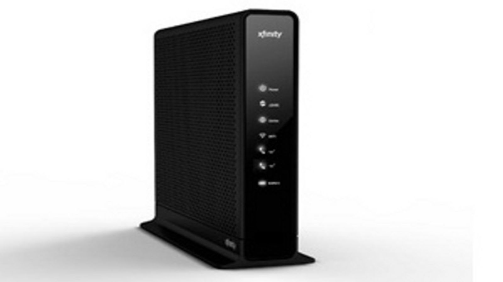
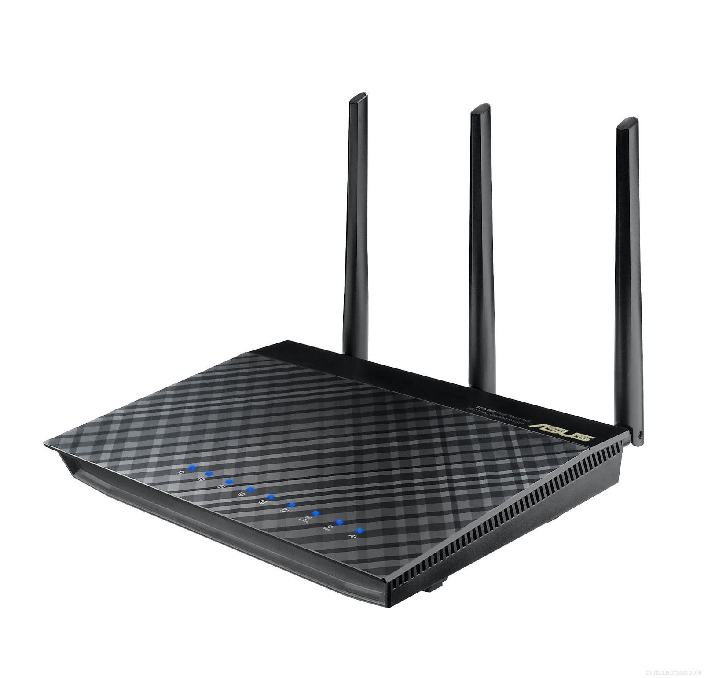
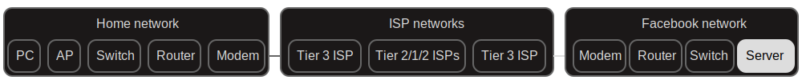

title: Who owns the Internet?
class: animation-fade
layout: true

---
class: center, middle

# Who owns the Internet?

???
Hello, and welcome to our program titled Who Owns the Internet.

---
class: center, middle

<hello-sticker name="Yurko" sticker-color="#b22"></hello-sticker>

---
class: center, middle

<hello-sticker name="Ben" sticker-color="#82d"></hello-sticker>

---
# Who owns the Internet?

???
This is part one of our series, what is the Internet.

Part one will focus on who owns all the things that we rely on

to go online.

--
## 1. What is the Internet?

???
First, we need to go over what the internet is and how it works.

This will be from a very high level- we are not getting overly technical.

--
## 2. Who owns the Internet?

???
Then we will discuss who owns what in the internet, with a particular focus
--
## 3. Who owns my data?

???
on our data and the ways in which online services try to collect and use it.

---
class: center, middle

# What Is the Internet?

---
class: center, middle

# 👥 **What do you think of when you hear the term "Internet"?**

???
**Prompt the audience here**

---
# What is the Internet?

<captioned-image img-file="img/internet-map.png" caption="By The Opte Project - Originally from the English Wikipedia; CC BY 2.5, https://commons.wikimedia.org/w/index.php?curid=25698718" img-width="24" float="right" white-bg="true"></captioned-image>

The Internet is the global system of interconnected computer networks that uses the Internet protocol suite (TCP/IP) to communicate between networks and devices. It is a network of networks that consists of private, public, academic, business, and government networks of local to global scope, linked by a broad array of electronic, wireless, and optical networking technologies. The Internet carries a vast range of information resources and services, such as the inter-linked hypertext documents and applications of the World Wide Web (WWW), electronic mail, telephony, and file sharing.

???
This is just the 1st paragraph from Wikipedia's entry for _Internet_

---
class: middle

# What is the Internet?

## TL;DR: A system of networks made up of hardware and software that enable data to go from one point to another.

???
So, can we answer the question to who owns the internet now? 

Not yet. First we need to go over how these networks actually function.

---
class: center, middle

# How does the Internet work?

---
class: center, middle

# What happens when I click on the _Like_ button in Facebook?

<captioned-image img-file="img/like-button.png" img-width="20"></captioned-image>

???
In order to provide some context and help us visualize things more easily,

let's talk about a particular example.

Imagine you are in facebook and you click "like" on a post. What happens then?

We will follow the data as it travels from your computer to facebook.

Please note that for the sake of simplicity and brevity, we will 

present things in a very simple manner.
---
class: center, middle

# The Internet:

# A physical and digital blend

---

# The physical: the "wires"

<captioned-image img-file="img/antenna.jpg" img-width="16" float="right" caption="Antennas on Towers by julianq, licensed under CC BY-SA 3.0"></captioned-image>

## - Desktop computer
## - Submarine cables
## - Cell phone tower

---

# The digital: the "apps"

<captioned-image img-file="img/software.jpg" img-width="24" float="right" caption="Day 15 - Software by dnwallace is licensed under CC BY 2.0"></captioned-image>

## - Mobile app
## - Operating system
## - Web browser

---
class: center, middle

# The "wires"

???
We'll start our journey with the wires.
---

# My home network

<captioned-image img-file="img/home-network.png" img-width="40"></captioned-image>

???
Our first stop is inside our home network.
---
class: crumb-parent

## My Computer

<captioned-image img-file="img/laptop.jpg" caption="By Kristoferb at English Wikipedia, CC BY-SA 3.0, https://commons.wikimedia.org/w/index.php?curid=37189521" img-width="18" float="right"></captioned-image>

### Sends and receives data to and from the switch or access point

???
This computer may be a desktop, laptop, or a smartphone.

It is responsible for sending and receiving data to and from a network.

Your personal computer is the point of entry to the Internet.

When you click the "Like" button under a post, the computer assembles a packet

of data and send it out through its network card.

This packet of data will contain the recipient (facebook) and the payload

(such as "user so-and-so has clicked this post").

---
## Access Point (AP)

<captioned-image img-file="img/access-point.jpg" caption="Macic7 at English Wikipedia, CC BY-SA 3.0 <https://creativecommons.org/licenses/by-sa/3.0>, via Wikimedia Commons" img-width="18" float="right"></captioned-image>
<!-- https://commons.wikimedia.org/wiki/File:Linksys_WAP54G.JPG -->

### Allows WiFi devices to join a Local Area Network (LAN)

???
A combination of a radio and antenna

If your home network contains WiFi, this is the device that makes it possible.

You can have multiple access points in a network.

This devices receives the data packet from your computer and sends it to the switch.

---
## Switch

<captioned-image img-file="img/switch.jpg" caption="Geek2003, CC BY-SA 3.0 <https://creativecommons.org/licenses/by-sa/3.0>, via Wikimedia Commons" img-width="24" float="right"></captioned-image>
<!-- https://commons.wikimedia.org/wiki/File:2550T-PWR-Front.jpg -->

### Allows devices inside a network to connect to each other

???
A device with many network ports

---
## Router

<captioned-image img-file="img/router.png" caption="https://eu.dlink.com/uk/en/products/di-604-4-port-broadband-router" img-width="18" float="right"></captioned-image>

### Moves data between networks

???
It connects your LAN to the rest of the Internet

---
## Modem

<captioned-image img-file="img/modem.jpg" caption="By Heidas - Own work, CC BY-SA 3.0, https://commons.wikimedia.org/w/index.php?curid=63436" img-width="14" float="right"></captioned-image>

### Converts digital data into an analog signal

### _DSL: Digital Subscriber Line_

???
Found in cable- or DSL-based connections

Converts the digital data from a computer (or router) into an analog signal

suitable for a transmission medium (like telephone lines)

---
class: router-modem

## Do I have a router? A modem?

### Or a "gateway"?

???
The ISP may rent you what they call a modem or router

Each function could be performed by a separate device,

depending on how you want to set up your network

Your ISP may provide either a modem or a "gateway": This is a device that performs multiple roles: modem, router, switch, and wireless access point.

---
class: center, middle

# 👥 **Can you identify these devices in your home network?**

???
Do you know if you own them?

---
# The ISP network

<captioned-image img-file="img/isp-network.png" caption="" img-width="50"></captioned-image>

???
The next stop is the ISP network
---
## Internet Service Provider (ISP)

<captioned-image img-file="img/isps-canada.jpg" caption="" img-width="32" float="right"></captioned-image>

### Connects you to the rest of the Internet

???
The company you subscribe to (Rogers/Bell/Teksavvy)

Broadband or cellular technology

These are sometimes called "last mile" providers

---
## ISP Tiers

<captioned-image img-file="img/isps.png" caption="Ludovic.ferre, CC BY-SA 3.0 <https://creativecommons.org/licenses/by-sa/3.0>, via Wikimedia Commons" img-width="21" white-bg="true" float="right"></captioned-image>
<!-- https://commons.wikimedia.org/wiki/File:Internet_Connectivity_Distribution_%26_Core.svg -->

### Move data between large networks

???
Traffic beyond a home ISP travels through a tiered structure.

They connect large networks to one another.

---
class: center, middle

<captioned-image img-file="img/submarine-cables.png" caption="submarinecablemap.com" img-width="50"></captioned-image>

???
This is a map of submarine cables around the world.

---
class: middle

<captioned-image img-file="img/big-tech-cables.png" img-width="40"></captioned-image>

???
And this one actually says which big tech companies own such cables

---
## Server computer

<captioned-image img-file="img/datacentre.jpg" caption="IMarcoHerrera, CC BY-SA 4.0 <https://creativecommons.org/licenses/by-sa/4.0>, via Wikimedia Commons" img-width="16" float="right"></captioned-image>

### Receives and processes data from users

???
After going through the ISP network, the packet finally arrives

at a computer inside one of Facebook's many data centres around the world.

That covers the wires.

---
class: center, middle

# The "apps"

???
Let's take a look at the apps now.

---
## Communication protocols

### Establish how to package and route data

TCP Tranmission Control Protocol  IP Internet Protocol

<captioned-image img-file="img/apps-crumbs-protocols.svg" float="right" img-width="16"></captioned-image>

<captioned-image img-file="img/protocols.jpg" caption="http://gumuskaya.com/images/tcp-ip.jpg" img-width="12"></captioned-image>

???
The communication protocol is the basic building block for any network to come together on the digital side.

It is the language that the computers use to send data back and forth to each other.

Two open protocols, TCP and IP, are responsible for most of the data routing

and transmission across the internet, and many more protocols are built on top

of them to provide application-level functionality, such as email, file transfer,

audio streaming, and lots more.

---

## Client software

### Transfers data between the computer and the server

<captioned-image img-file="img/apps-crumbs-client.svg" float="right" img-width="16"></captioned-image>

<captioned-image img-file="img/mobile-app.png" caption="https://techniblogic.com/wp-content/uploads/2017/02/Telegram-Secret-chat-1.png" img-width="10" ></captioned-image>

???
This is the software that runs on your computer

An installed application

An Internet browser

A website running on the browser

The app I install on my computer or smartphone, or a website I visit.

It provides a user interface to interact with an online service

---
## Server software

### Processes data

<captioned-image img-file="img/apps-crumbs-server.svg" float="right" img-width="16"></captioned-image>

<captioned-image img-file="img/server-sw.png" caption="By ZxxZxxZ - Own work, GPL, https://commons.wikimedia.org/w/index.php?curid=16485488" img-width="24" float="right"></captioned-image>

???
Server software processes website requests, user sessions, database queries, etc.

This is the software that would run on a Facebook datacenter computer.

The payload is extracted from the data packet at this point, and the databases

in facebook are updated with a record of you liking the post.

Facebook then sends a message back to your computer to say, yes, you have now liked this post.

Next time someone loads that post, they will be able to see you liked it.

---
## The Internet: All together now

<captioned-image img-file="img/internet-all-together.svg" img-width="40"></captioned-image>

???

---
class: center, middle

# Who owns the Internet?

---
## Who owns the wires?

<captioned-image img-file="img/internet-wires-ownership.svg" img-width="38"></captioned-image>

???

---
class: center, middle

# 👥 **Is there anything you would like to change about your Internet service?**

---

## Internet Service Providers

### Engage in price fixing

### Throttle Internet speeds

### Lobby the government

### Track user data

???
Tell a story where the infrastructure extracts from the quality of life of future generations.

---
## Government

<captioned-image img-file="img/parliament.jpg" caption="Coolcaesar, CC BY-SA 3.0 <https://creativecommons.org/licenses/by-sa/3.0>, via Wikimedia Commons" img-width="20" float="right"></captioned-image>
<!-- https://commons.wikimedia.org/wiki/File:Parliamenthill.jpg -->

### Foster competition

### Operate or manage ISPs

### Engage in mass surveillance

### Block Internet access

???
A government owned ISP does not necessarily solve the issues of ownerhsip

In some countries governments are able to shut down internet services, or monitor and control the apps and content available to citizens

---
## Who owns the apps?

<captioned-image img-file="img/internet-apps-ownership.svg" img-width="38"></captioned-image>

???
Part of answering the question who owns the internet, is understanding who owns the apps
---
class: center, middle

# What happens when I click on the _Like_ button in Facebook?

<captioned-image img-file="img/like-button.png" img-width="20"></captioned-image>

---
class: center, middle

# What happens ~~when~~ **before** I click on the _Like_ button in Facebook?

<captioned-image img-file="img/like-button.png" img-width="20"></captioned-image>

---
class: center, middle

# 👥 **Do you have a Facebook account, and what kind of data do you know they collect?**

---
class: center, middle

 <video height="640" controls muted>
  <source src="img/facebook-data-tracking.mp4" type="video/mp4">
 </video> 

???
Put in chat links to checking you own Facebook data

https://www.facebook.com/help/1701730696756992/?helpref=hc_fnav

---
## Data tracked by Facebook

<h3>Profile information and email addresses</h3>
<h3> Clicked ads, installed apps</h3>
<h3> Events you joined and were invited to</h3>
<h3> Facebook Chat conversation history</h3>
<h3> IP address, dates and times, and location of access</h3>
<h3> Online behaviour (e.g. time spent looking at content)</h3>
<h3> Browsing activity <strong>off</strong> Facebook</h3>

???
They collect of data- is it theirs to keep in the first place? 

We don't even need to visit their site to have them collect data on us.

**Talk about that and Firefox's Facebook container: cbc.ca vs wikipedia.org**

---
class: center, middle

# Who "owns" our data?

???
So now that we have these wires in place and have the apps to

send data back and forth, who owns this data?

Is it facebook? Is it the internet service providers?

---
class: middle

<captioned-image img-file="img/iphone-tos.jpg" caption="bfishadow, licensed with CC BY 2.0 https://creativecommons.org/licenses/by/2.0/" img-width="16" float="off"></captioned-image>

???
Unfortunately, depending on the terms of service we agree to when we sign up for a given service,

chances are whoever collects it.

How does this happen? 

What is driving all this data collection?

---
## Why is our data so precious?

### Surveillance capitalism

### Attention mining

???
The business model of most online companies is based on ad revenue 

Define surveillance capitalism

https://www.goodreads.com/book/show/26195941-the-age-of-surveillance-capitalism

Define Attention Mining

Facebook and othee social media giants display stories which encourage you to click on them and maximize their ad revenues

---
class: center, middle

<captioned-image img-file="img/fb-user-worth.png" img-width="28"></captioned-image>

???

---
## Real-time bidding

<captioned-image img-file="img/real-time-bidding.jpg" img-width="24" float="off"></captioned-image>

???
Real-time bidding is a means by which advertising inventory is bought

and sold on a per-impression basis, via instantaneous

programmatic auction, similar to financial markets.

With real-time bidding, advertising buyers bid on an impression and,

if the bid is  won, the buyer's ad is instantly displayed

on the publisher's site.

Who is the product? YOU

---
## The Facebook content funnel

<captioned-image img-file="img/facebook-tunnel.png" caption="https://stratechery.com/2018/the-european-union-versus-the-internet/" img-width="55" float="off"></captioned-image>

???
This chart shows how the past decade saw the rise of facebook

as a referral source for news. This means that more people are reaching content through it.

A near duopoly between Facebook and Google for Online Advertising.

Online advertising is driving down other forms of advertising and ad revenues for independent publishing such as smalll local news publishers

---
## Referral source of traffic to top web publishers

<captioned-image img-file="img/content-gates.png" caption="https://blog.parse.ly/post/2855/facebook-continues-to-beat-google-in-sending-traffic-to-top-publishers/" img-width="32" float="off"></captioned-image>

???
Traditionally, search has led us to different websites.

Increasingly, facebook (and google) are becoming a “funnel”/”filter” for search results

and content in their ecosystem.

These companies engage in real-time bidding for advertisers to bid on impressions.

---
## Entrenched monopolies

<captioned-image img-file="img/web-monopolies.jpg" caption="https://www.visualcapitalist.com/internet-giants-owns-web/" img-width="24" float="off"></captioned-image>

???
Entrenched monopolies:

Use market dominance to quash competition

Google’s dominance in Search, Chrome, and Android create an anti-competitive landscape

Facebook linking user data across Instagram, WhatsApp, and Oculus

They are able to track user data across different services and devices

Thanks to large advertising revenue and acquisitions, they are able to fence off

the social media market and become the only player in this area.

---
class: center, middle

# 👥 **What are your top three sources of news?**

---
## User behaviour manipulation

<captioned-image img-file="img/facebook-ca.png" caption="" img-width="25" float="left"></captioned-image>

### _"We want to psychologically figure out how to manipulate you as fast as possible”_ 
### - The Social Dilemma

???
User behaviour manipulation

These tech giants now dictate what you see and how you communicate online.

One consequence -both intended and unintended- of this system is the behaviour manipulation of users.

This may be due to users being targeted for maximum engagement -and thus monetization-

or for an explicit outcome (polarizing voters to sway election results).

We haven't even talked about data breaches and geoblocks.

Did i buy a device, or did i subscribe to a service?

---
class: center, middle

# We don't own the wires, the apps, or our data...

---
## ...so what _can_ we change?

<captioned-image img-file="img/internet-apps-ownership.svg" img-width="38"></captioned-image>

???
Going back to the original question of who owns the internet.

While the Internet Service Providers may claim ownership to access to the internet at large,

it's mostly these internet giants that control the data and content availability to their users.

So, is there a way we opt out of this system and still be able to participate in the Internet?

---

## Easy: We build a new Internet

<captioned-image img-file="img/ross.png" img-width="50"></captioned-image>

???
Easy. We build a new Internet.

---
class: center, middle

# See us in part two:
# **How to reclaim the Internet**

---

class: center, middle, contact

# Are you ready to get involved?

# 👉 https://tomesh.net/contact 👈
