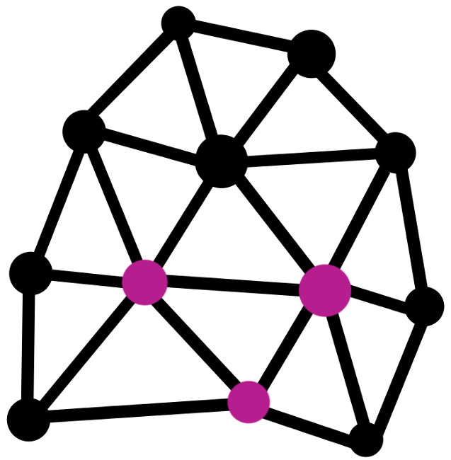
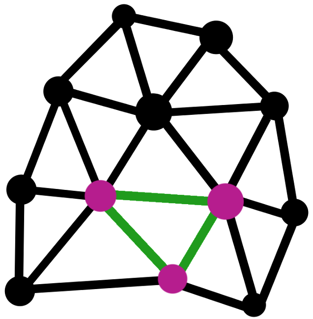
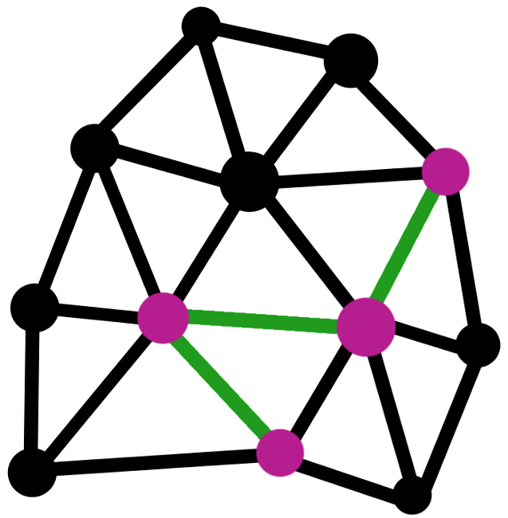
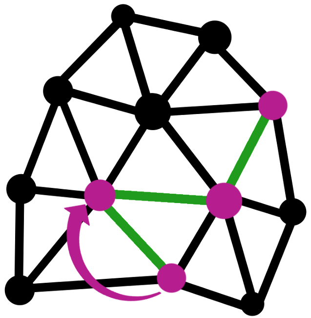
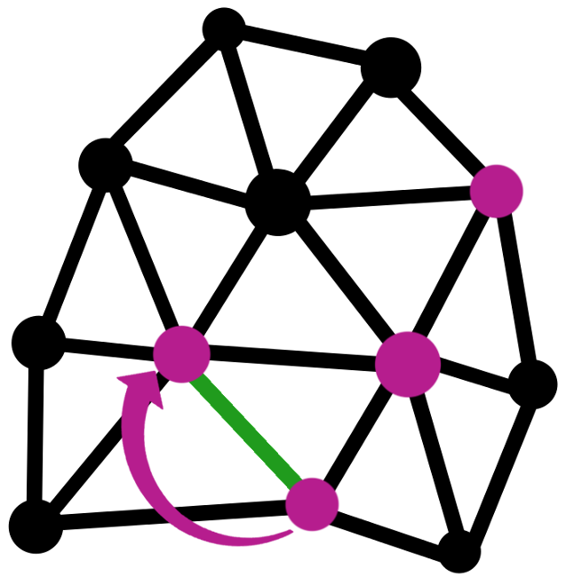
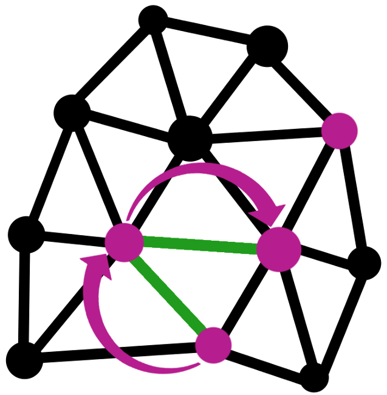
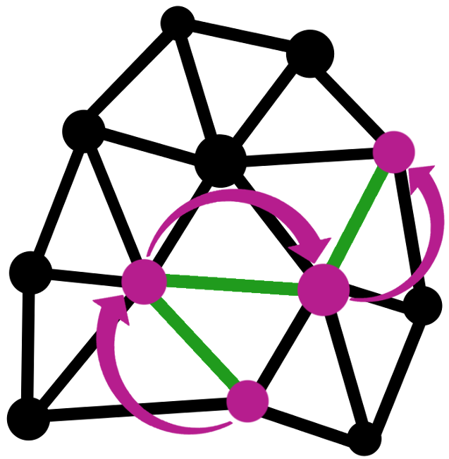

!SLIDE

# Networks

!SLIDE

# Parts of a Network

!SLIDE

# Parts of a Network

!SLIDE

# Moving Through a Network

!SLIDE

# Moving Through a Network

!SLIDE

# Moving Through a Network

!SLIDE

# Moving Through a Network

!SLIDE

# Moving Through a Network

!SLIDE

# Network Types

~~~SECTION:notes~~~

Image credit (1964) Paul Baran, On distributed communications networks

## Workshop Schedule

1:40 - 2:30 (0:50) How computers talk
2:30 - 2:40 BREAK

## Section II: How computers talk

Goals:
- Identify basic (technical/structural) components of a network
- Make a case for why networks are fundamental/so popular (?)

Activity:
- Needs / Yields Yarn Toss (Sharing Resources on a Network)
    <Potential Protocol Analogy Extension>

- Quick Terminology Presentation

    Parts of a network
      Link
      Node
    Moving around a network
      Hop
      Route/Path
      Data/Packet
    Common topologies (physical vs. conceptual), for conceptual bucketed as:
      centralized;
      decentralized;
      distributed

- Embodying a Network

1. 'Linear Network' or 'Path'
    (Show how hops through lead to wanting stability, what if a node goes offline, disconnects from the network)
    Mechanic: string, clips with prop message that they move around, scissors to cut connections
    (ISP going down: Censorship; Natural Disaster; Aliens)

2. Move into a Star and do switching;
    (show the star falling apart and being taken offline)

    - prompt of ISP going down
    - connection to cultural/social issues:
        - privacy, who has my information
        - cost (ISP monopoly) equal access
        - not knowing stuff? (literacy)
        - resiliency
        - agency (censorship)

3. Move to decentralized
    - (this might be hard to do depending on size)
    - check in on the social issues

4. Move to distributed ()
    - check in on the social issues

Wrap Up conversation about how this looks like a mesh

~~~ENDSECTION~~~
