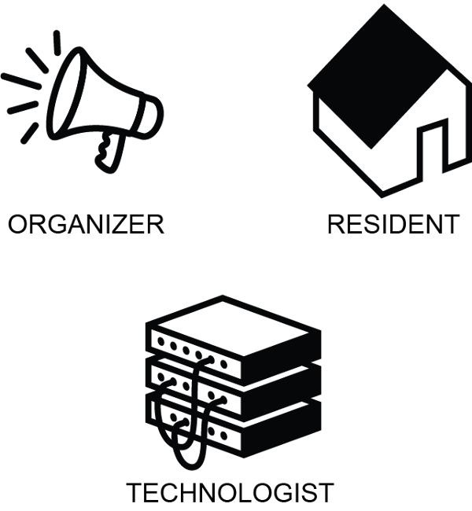
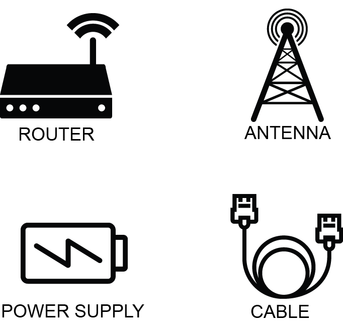
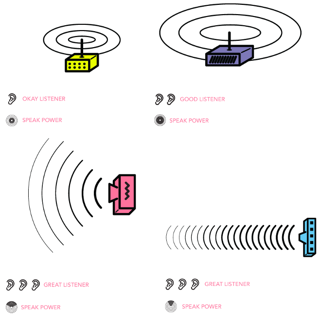

!SLIDE

# Building a Network

~~~SECTION:notes~~~

Many different kinds of people are involved in creating community infrastructure...

~~~ENDSECTION~~~

!SLIDE

# Building a Network

~~~SECTION:notes~~~

Technical bits required: routers to propagate the network by sending wi-fi waves, antennas to mount the routers on to get the signal wide enough and above obstacles, cable to plug it all in, and a power source to get it all running!

~~~ENDSECTION~~~

!SLIDE

# Building a Network

!SLIDE

# Building a Network

~~~SECTION:notes~~~

## Workshop Schedule

2:30 - 2:40 BREAK
2:50 - 4:00 (0:50) Networks include people!

## Section II: Networks include people!

Goals:
- Show how the human and technical components both are required/interact for a network
- Connect to activities and interest of tomesh, upcoming game at makerfestival

Activity:
- Play "Every Network Tells a Story"

 decide which location based on conversation with people

 - Low Power Omnidirectional (All Direction) Router
 - High Power Omnidirectional (All Direction) Router
 - High Power Sector (Directional) Router
 - High Power Focused (Narrow Beam) Router

~~~ENDSECTION~~~
