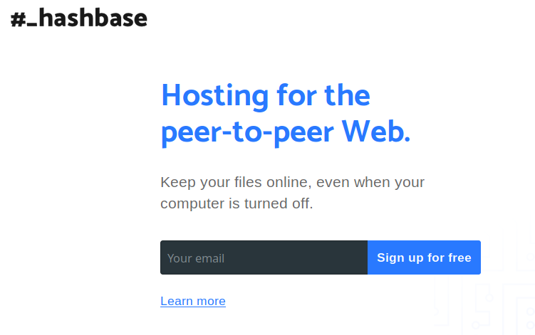

title: It Works On Paper
subtitle: The Networks We Need
class: animation-fade
layout: true

---

class: center, middle

# It Works On Paper:

## The Networks We Need

---

class: center, middle

  

    
Hello
my name is
  

  
Bob

  

???

---

class: center, middle

# Toronto Mesh

???
Toronto Mesh is a group of volunteers that was started at CivicTechTO in early 2016.

Our work includes, among other things, building hardware and software solutions for networking applications,

and organizing outreach activities that focus on technical literacy.

---

# Agenda

### Goal: Imagine networks that work for us

???
Today, I will talk about some ways in which we can build a better Web together.

--

## 1. Today's Networks

## 2. Inspiration

## 3. Doodling

## 4. Idea Sharing

???
First, I will talk about some of the challenges the Internet is facing today.

Then, I will discuss some of the solutions being explored to address them.

---

class: center, middle

# Today's Networks

## A five minute overview

???
What does the Web look like today?

---

class: center, middle

# What Makes Up A Network?

## Infrastructure
## Services
## Community

---

class: center, middle

Today's Networks

# Infrastructure

???
Let's start with infrastructure.

When I say "infrastructure" I mean everything that lives on the physical layer:

---

class: center

## Infrastructure

???
Cables, fibre, radios, antennas.

---

class: center, middle

Today's Infrastructure

# Internet Service Providers (ISPs)

# Governments

???
Most of the infrastructure that we use to go online is managed by Internet Service Providers (ISPs),

and in many cases, regulated by a government authority.

--

## Censorship - Surveillance

???
Both of them may engage in censorship, and surveillance.

---

class: center, i-censorship

Today's Infrastructure: Censorship

https://www.visualcapitalist.com/internet-censorship-map/

???
Censorship at the infrastructure level is mostly dictated and carried out by government agencies.

This is a flowchart the Chinese government uses to assess online content.

Certain governments have opted for shutting down internet access altogether in times of civil unrest.

---

class: center, i-surveillance

Today's Infrastructure: Surveillance

https://arstechnica.com/tech-policy/2017/03/senate-votes-to-let-isps-sell-your-web-browsing-history-to-advertisers/

???
Surveillance covers all types of data collection, whether it's for profit or for social control.

---

class: center, middle

Today's Networks

# Services

???
Let's move on to services.

When I say "services, " I mean everything that lives on the digital layer:

---

class: center, middle

## Services

???
or things we can call software: apps, websites, desktop programs, ones and zeros.

---

class: center, middle

Today's Services

<i class="fab fa-facebook"></i>
<i class="fab fa-twitter"></i>
<i class="fab fa-instagram"></i>
<i class="fab fa-tumblr"></i>
<i class="fab fa-linkedin-in"></i>
<i class="fab fa-reddit"></i>
<i class="fab fa-pinterest"></i>
<i class="fab fa-whatsapp"></i>
<i class="fab fa-slack"></i>
<i class="fab fa-dropbox"></i>
<i class="fab fa-google-drive"></i>
<i class="fab fa-youtube"></i>

???
Think of the websites you visit and the apps you use on your  phone.

--

## Centralization - Censorship - Surveillance

???
Many of these services are controlled by centralized systems

that may also engage in censorship and surveillance practices.

---

class: center

Today's Services: Centralization

<i class="fab fa-google huge-icon"></i><i class="fab fa-facebook huge-icon"></i><i class="fab fa-amazon huge-icon"></i>

https://staltz.com/the-web-began-dying-in-2014-heres-how.html  
https://bdtechtalks.com/2017/10/27/why-does-the-centralized-internet-suck/  
https://techcrunch.com/2017/07/28/aws-wont-be-ceding-its-massive-market-share-lead-anytime-soon/ 

???
Why is centralization a bad thing?

Google, Facebook, and Amazon have come to dominate the services that support the internet.

Google processes more than 5 billion queries per day.

Facebook has more than 2 billion monthly active users.

Amazon controls over one third of all cloud infrastructure services.

Market dominance has turned these companies into gatekeepers of information,

so we have to trust them to use their power fairly and responsibly...but they don't.

In fact, all of them have huge financial incentives to not only monitor our behaviour,

but also manipulate it whenever possible.

---

class: center, s-censorship

Today's Services: Censorship

https://www.pinknews.co.uk/2019/03/14/tumblr-suffers-150-million-drop-traffic-porn-ban/  
https://www.businessinsider.com/flemish-museums-mocked-facebook-for-censoring-peter-paul-rubens-nudes-2018-7
http://www.ic.gc.ca/eic/site/062.nsf/eng/h_00108.html

???
Think about the power they yield when it comes to content moderation and censorship- 

we are relying on businesses to dictate when content should

and should not be blocked.

This power has been noticed by governments, and they have started to get more involved in the

conversation regarding online content.

This week, the Canadian federal government announced a digital charter that aims to

regulate online platforms when it comes to trust, privacy, and hate speech.

We'll see how this develops.

---

class: center

Today's Services: Surveillance

https://en.wikipedia.org/wiki/PRISM_%28surveillance_program%29  
https://www.telegraph.co.uk/technology/social-media/9780565/Facebook-terms-and-conditions-why-you-dont-own-your-online-life.html

???
As of right now, these online platforms not only claim ownership of our personal data, but 

also share it with governments agencies and marketing firms.

---

class: center, middle

Today's Networks

# Community

???
Lastly, a network needs a community: without people using it,

technology has no purpose!

---

class: center

## Community

???
By community, I mean any group of people: our family, our friends,

our neighbourhood, or even our city!

---

class: center, middle

Today's Communities

## Users

### Group Members
### Followers
### Subscribers
### Moderators

???
How do we join an online communities, and how do we communicate today?

We visit a website for a popular platform and sign their terms of service,

then we go ahead and form or join facebook or whatsapp groups.

We become redditors, Twitter followers or Youtube subscribers.

It doesn't matter the platform, we turn into a monetization target 

for tech giant A, B, or C.

---

class: middle, center

# Inspiration

???
So, we have identified some issues. What can we do about them?

How can we do better than today's networks?

---

class: center, middle

### Inspiration

## Concepts for a Better Web

### > Open Source

### > Peer-to-Peer

### > Mesh Networks

---

class: center

# <i class="fab fa-osi"></i> Open Source

### A product or service includes permission to use its source code, design documents, or data

#### Examples: 

### Linux OS

### Toronto Mesh

https://www.kernel.org/  
https://github.com/tomeshnet/documents/tree/master/governance

???
The first one is the concept of open source.

Open source means the data for a given product or service is available for study, analysis, or even modification.

This can apply to just about any area- software, hardware, or even governance.

One example is the governance documents that Toronto Mesh makes public through Github. 

---

class: center

# <i class="fas fa-users"></i> Peer-to-Peer (P2P)

### Members work and communicate with one another without a central authority

#### Examples:

### BitTorrent

### RideAustin

https://www.rideaustin.com/  
https://en.wikipedia.org/wiki/BitTorrent

???
The next term is **peer-to-peer**.

In a peer-to-peer system, members of a group or network can communicate with one another,

instead of relying on a centralized service.

One example is RideAustin, a ride-sharing co-op that links riders directly to vehicle operators.

---

class: center

#  Mesh Networks

### Nodes connect to as many other nodes as possible, and cooperate with one another to efficiently transmit data back and forth.

#### Examples:

## Guifi.net
## Freifunk

https://en.wikipedia.org/wiki/Mesh_networking

???
Last is the concept of a Mesh Network.

Members of a mesh network, also called nodes, connect to as many other nodes as possible,

and cooperate with one another to efficiently transmit data back and forth.

Let's take a look at a couple of internet access models to see how this idea can work in practice.

---

class: center, isp-monopoly

Mesh Networks

### Access model: ISP <> Content

???
This is an over-simplified version of how we access the internet today. 

We connect to an ISP, and in turn they connect us to an content provider.

What would it look like with a mesh network?

---

class: center, isp-mesh

Mesh Networks

### Access model: Mesh <> ISP <> Content

???
This is just one option:

Using a mesh network, only a few computers require an internet connection,

and all of its members can still access content.

With these ideas in mind, let's go over some infrastructure ideas.

---

class: center, middle

Infrastructure Inspiration

## Ownership Models

???
Communities are exploring different ownership models for infrastructure.

--

### > Community Networks 
### > Public Sector

???
Some are leveraging mesh technologies to build networks based on their needs, 

while others are pushing local governments to provide affordable internet access.

---

class: center

Infrastructure Inspiration

### Community Networks

https://www.nycmesh.net/map  
https://freifunk.net/en/how-to-join/find-your-nearest-community/

???
Two examples of community networks are Freifunk and NYCMesh.

Freifunk is a non-commercial grassroots initiative to support free computer networks in Germany.

NYCMesh is a non-profit project of the Internet Society.

Having control of a network at the community level lowers the incentive

for discriminating against network traffic,

and it makes censorship and surveillance harder to implement.

---

class: center, middle

Services Inspiration

## > Decentralized Services
## > Peer-to-peer Protocols

???
That covers infrastructure, how about services?

I will talk about a handful of open source projects that aim to deliver an alternative

to centralized platforms- I will refer to them as decentralized services and 

peer-to-peer protocols.

---

class: center, middle

Services Inspiration

## Decentralized Services

### > Matrix
### > Mastodon

???
Two services that represent the move towards decentralization are Matrix and Mastodon.

---

class: center, middle

Services Inspiration

 

## An open network for secure, decentralized communication

https://matrix.org/blog/index  

???
If you have ever used Slack, think of Matrix as a decentralized version of it.

---

class: center

Services Inspiration

### Matrix: Homeservers + Clients

https://matrix.org/blog/index#about  

???
Matrix works with Homeservers and Clients.

Using a client application on my phone

or my computer, I connect to a homeserver.

The homeserver connects me to other people connected to it,

and to other homeservers.

---

class: center, middle

Services Inspiration

# Matrix Requirements

## > Server: Matrix Synapse

## > Client: Riot (Web/Desktop/Mobile)

???
In order to deploy a Matrix, you need a dedicated

machine to run the home server (called Synapse),

and client application- most people use Riot.

---

class: center

Services Inspiration

## chat.tomesh.net

???
This is a screenshot of the Riot application on my laptop.

---

class: center, middle

Services Inspiration

# Mastodon

## An online, self-hosted social media, and social networking service

https://en.wikipedia.org/wiki/Mastodon_(software)  

???
You can think of Mastodon as a decentralized version of Twitter.

---

class: center, middle

Services Inspiration

# Mastodon Requirements

## > Server: Mastodon Instance

## > Client: Web/Desktop/Mobile - lots

https://github.com/tootsuite/documentation/blob/master/Using-Mastodon/Apps.md  

???
Just like Matrix, you need a server that can host the data,

as well as client software to access it.

---

class: center, mastodon-join

Services Inspiration

https://joinmastodon.org/  

???
The Mastodon website maintains a listing of instances that you can join,

based on how active it is, and whether it focuses on a particular interest of yours.

---

class: center, mastodon-ui

Services Inspiration

https://en.wikipedia.org/wiki/Mastodon_(software)  

???
This is a screenshot of the web UI for Mastodon.

---

class: center, middle

Services Inspiration

## Peer-to-Peer **Protocols**

### **Protocol**: A system of rules that allows entities in a communications system to transmit information

### > Scuttlebutt
### > Dat

???
I'll talk about a couple of peer-to-peer protocols next: Scuttlebutt and Dat

A protocol is just a set of rules that computers in a network use

to communicate with one another.

---

class: center, isp-mesh

Services Inspiration

### Access model: Mesh <> ISP <> Content

???
Think about how we publish and access content on social networks.

Let's go back to our earlier model for content access

Imagine a friend of yours posts a photo on facebook.

Facebook will add that post to your feed, and you'll see it next time you log in.

Can we think of another way to share our data?

---

class: center, mesh-content

Services Inspiration

### Access model: Mesh + P2P Content

???
Using peer-to-peer protocols, we are able to do away with centralized services

and share content directly with one another.

One such protocol is called Scuttlebutt.

---

class: center, middle

Services Inspiration

# Scuttlebutt

## A secure gossip platform

https://www.scuttlebutt.nz/

???
Scuttlebutt is a protocol for secure communications,

on top of which different kinds of applications can be built.

---

class: center, middle

Services Inspiration

# Scuttlebutt

### Offline-friendly

### No central server

### No central database

???
Applications that work well offline and that no one person can control

Scuttlebutt clients connect to their peers to exchange information- 

this means I hold my friends' data and they hold mine.

Because there are no central servers, 

it is much harder to collect data on a massive scale

There is no "company" for a tech giant to buy, and no single database

for governments to data mine.

---

class: center, middle

Services Inspiration

# Scuttlebutt Requirements

## > Software

### Patch* on desktop
### Manyverse on mobile

## > Peers (+ Pubs)

https://www.scuttlebutt.nz/applications.html  

???
This is a fully peer-to-peer system, so there is no need for a server.

You can istall patchwork, patchbay, or patchfoo on your computer,

or manyverse on your phone.

But the requirements to connect with another peer also differs.

If I want to start "following" friends, I have two options:

1. Open the client software while we are on the same network (wired or wireless) so I can see them.

2. Get an invite to join a "Pub" they are connected to. A Pub is a server that allows peers

to connect to each other.

---

class: center

Services Inspiration

https://ssbc.github.io/scuttlebutt-protocol-guide/  

???
The computer or phone that you use for Scuttlebutt will hold your identity,

your data, and your friends' data, so the software has been designed to

only download the data for peers up to three hops away from you.

---

class: center, patchwork

Services Inspiration

https://github.com/ssbc/patchwork

???
There are many clients for the scuttlebutt protocol, 

and this is one of them, it's called "Patchwork".

---

class: center, middle

Services Inspiration

# Dat

## A protocol for sharing data between computers

https://docs.datproject.org/

???
Dat is a protocol for sharing data between computers

on top of which different kinds of applications can be built.

---

class: center

Services Inspiration

# Dat

### Original uploader can update content

### Full version history

### Can handle large amounts of data

https://docs.datproject.org/

---

class: center, middle

Services Inspiration

# Dat Requirements

## > Software

### Dat Desktop
### Beaker Browser

## > Peers

---

class: center, beaker-ui

Services Inspiration

https://beakerbrowser.com/

???
Visitors to a site connect to **one another**

Seed files by visiting a site

View source

One-click publishing from the browser

---

class: center, middle

Services Inspiration

https://hashbase.io/

???

---

class: middle, center

# Doodling Time!

## What does your ideal network look like?

???
So far we have covered the shortcomings of today's networks,

as well as several projects groups are working on to improve things.

Now, how do you see your communities evolving?

We have some paper and markers to help us imagine what a network

can look like if it is built for our community first and foremost.  

---

class: center, middle

## Network and model ideas:

### Sharing and storing pictures with family members

### Creating and spreading digital art together

### A self-moderating charter for peer-to-peer platforms  

### Tech literacy platforms for a local community

---

class: center, middle

## Thank You!

### <i class="fas fa-link"></i> tomesh.net

### <i class="fas fa-comments"></i> chat.tomesh.net

### <i class="fab fa-twitter"></i> @tomeshnet

???
Thank you!
