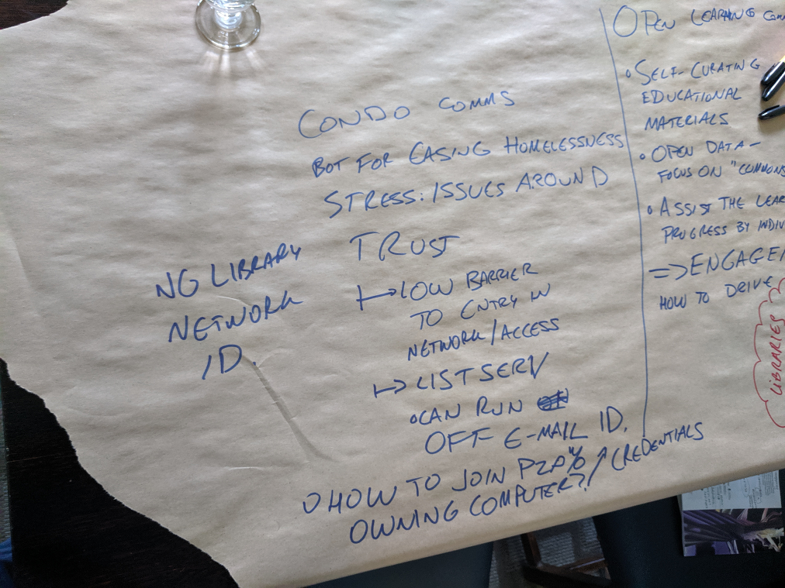
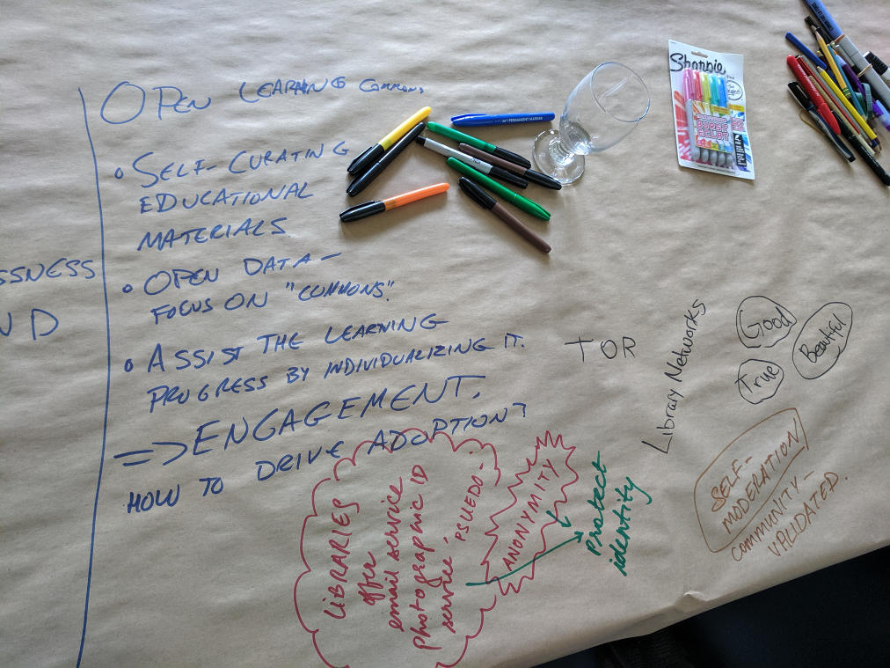
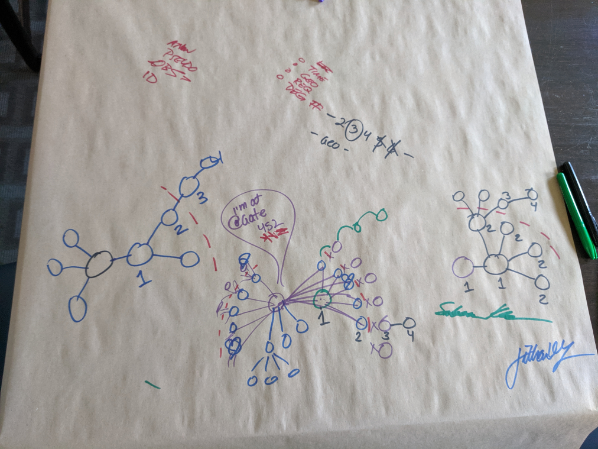

# Workshop Discussion

Three groups broke off after the presentation to discuss networks they would like to see. 
The following is a summary of the ideas we talked about.

### Anita, Brian, Rosemary

_We're interested in things like Mastodon, what it means to be part of a smaller network, and give up the advantage of this randomness of information we get from Facebook, etc._

_We talked about the differences between the Chinese web and North American one._

- People make money by taking content from one web and bringing it to the other one, with no regard for copyright.
- The notion of information arbitrage was brought up: people translate American videos into Chinese, breaking copyrights.
- Two countries/ecosystems/economies where the laws and cultural norms are different for the flow of information (non-intersecting efforts).

_What does it mean to have multiple intersecting networks instead of having one network or protocol? How do you control your data?_

- You can be a self-serving merchant that understands the rules of both networks, or you can be a group like the UN that governs the data interchanges. There are many perspectives in this arena to be explored.

### Vidhi, Robert, Dante

_We were thinking about making a network hyperlocal. It's not the Facebook idea of connecting the world, but of staying connected with my community- whether it's people experiencing homelessness or indigenous youth, their needs around trust is very important._

- The information that is shared within the networks, something that gets trust a lot, is information that is validated by the network group. There is a lot of knowledge within that network that is not represented officially.

_We started talking about the idea of a chat platform for a condo building that would be locally hosted and have it run on a mesh platform._

_We also talked about library networks and how to lower barriers to entry- how an email becomes your ID. Educational networks like open learning commons could become part of that space too._

_We discussed about some of the barriers in tech especially for folks experiencing homelessness, who may rely on access to computers through a library. They might have a phone with SMS service so they can use two-factor authentication, but if the phone get stolen, they will face some challenges just trying to access their emails. If you are relying entirely on public computers, getting access to an account that you have lost a password to becomes a very difficult challenge._

- The barrier to entry for any network is high- starting with the hardware. Also, how do you even learn about the network? Once you're on the network, how do you learn to navigate it? The experience between a beginner and a power user can be quite large.

- Content moderation and sub-moderation: Communities deciding what kind of content is appropriate. People being able to access the internet using anonymity, how do we know that they are not linked to illegal (cp) content?

- How do we handle this problem, and how do you translate this decision to a community? When you are coming up with your service/project, you might think about whether you can make a portion of it anonymous-friendly, and if you are, how do you deal with validating returning users?

_In the Scuttlebutt community, there is a project that breaks up a key/secret into "shards" that are sent out to a set of friends that I trust. Then, if I wanted to retrieve a lost secret, asset, key, or identity, I could ping each friend with a friend-specific password to re-assemble all the shards. This method of password management is more about an organic connection than a particular technology. Think Captain Planet and the Planeteers' rings._

### Jillian, Saleem

_We were thinking of people who do a lot of travelling- sometimes your flight might be delayed once you're in the airport. In the first couple of scenarios, maybe you are spending some time with someone known or unknown to you, on your extended network, or someone who might see from time to time might be on the network. Maybe someone who's using you to sidestep duty free limits.
There might be a request you want to make of someone._

- There are multiple dimensions to it- the location-based aspect, the temporal aspect, and maybe there is the specific request that you are exploring.

- With you at a centre of a network, you may find your partner and very close friends on a "first-degree" level. Each of them may have their own set of "rings", and you could add those people. Those would be your "second-degree". These may be people you know but aren't very close too. In this manner, you could even have third- and fourth- degree of trust further out.

- For a lot of requests, you could cut off your access to first- and second- degree levels of trust. For instance, if you want to share that you are at the  airport you might only want to share that with your very close friends (up to first-degree)

- When it comes to levels of trust, you may open yourself to requests to your first-degree of trust only if you are looking at someone looking for a couch for the night.

- We were exploring what could dictate the level of trust- how do you control your identity access? As you make connections, you might open your identity gradually, only presenting a portion of your name, for example. This links back to the concept of "dynamic level of trust".

_I don't have the privilege, luxury of a "local" community, so my local is actually around the world. I want to be able to formulate connections in more than just a geographical basis. This kind of connections is becoming more commonplace, that is completely enabled by telecommunications._

- What if you only wanted to ping the people in your community that are LGBT? 
As an example, there is an app that is only for indigenous youth, but the network needs to be protected somehow in order to prevent violence. The way they accomplish this is by providing a key that you get at your local community centre that will give you access to the network.

